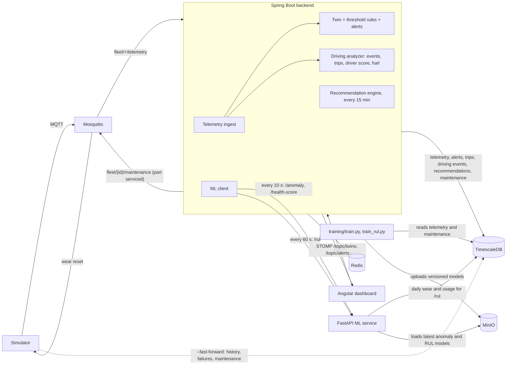

# Fleet Twin

A digital-twin based predictive fleet maintenance system. Simulated vehicles publish telemetry over
MQTT; the backend stores it, keeps a live twin of every vehicle, raises alerts from threshold rules
and from an anomaly model, predicts how long each part has left, scores driving and fuel use, and
turns all of that into maintenance recommendations. A dashboard shows it in real time.

## Features

- **Digital twin** per vehicle: identity, location and heading, MOVING / IDLE / OFFLINE state, latest
  sensor values, a status for each component (engine, battery, brakes, four tyres, fuel system),
  health score and anomaly flag. Live state is in Redis; PostgreSQL keeps the history.
- **Alerts** from two sources: threshold rules (`RULE`) and the anomaly model (`ML`). The same open
  alert is never raised twice; an alert stays open until it is acknowledged.
- **Anomaly detection**: an XGBoost model over rolling-window features, trained on simulator data,
  stored in MinIO and served by the ML service with the top contributing features as reasons.
  See [docs/model_report.md](docs/model_report.md).
- **Remaining useful life** for brake pads, battery, tyres and engine: days left with a lower and
  upper bound and a confidence, from per-component models trained on run-to-failure history.
- **Driver behaviour**: harsh braking, rapid acceleration, speeding, sharp cornering and excessive
  idling are detected from telemetry, telemetry is split into trips, and each trip and day gets a
  0–100 driver score from a published formula. See [docs/driver_score.md](docs/driver_score.md).
- **Fuel analysis**: efficiency per trip and day, fuel lost to idling, and two anomalies: fuel
  that disappears while parked (`FUEL_DROP`) and trips far below the vehicle's own baseline
  (`LOW_EFFICIENCY`).
- **Maintenance recommendations**: configurable rules combine RUL, component status, open alerts,
  anomaly history and time or distance since the last service. Each recommendation states its
  evidence in plain English. Completing one records the maintenance and resets the part's wear.
- **Dashboard**: fleet map, vehicle twin view with charts and anomaly markers, live alert feed,
  Maintenance Planner, and a Drivers & Fuel page.

## Architecture



More detail in [docs/architecture.md](docs/architecture.md).

```
fleet-twin/
  backend/      Spring Boot 3.5, Java 21, Maven
  frontend/     Angular 22
  ml-service/   Python 3.11, FastAPI, XGBoost; training scripts in ml-service/training
  simulator/    Python MQTT telemetry simulator
  infra/        docker-compose.yml, mosquitto config, db init scripts
  docs/         architecture notes, model report, driver score formula
```

## Prerequisites

| Tool | Version used |
|---|---|
| Java (JDK) | 21 |
| Maven | 3.9 |
| Node.js / npm | 24 / 11 |
| Angular CLI | 22 |
| Python | 3.11 (`python3.11` must be on the PATH) |
| Docker Desktop | running, with Compose v2+ |
| OpenMP runtime | macOS only, needed by XGBoost: `brew install libomp` |

## Ports

| Port | Service |
|---|---|
| 5432 | PostgreSQL / TimescaleDB |
| 1883 | Mosquitto (MQTT) |
| 9000 / 9001 | MinIO API / console |
| 6379 | Redis |
| 8080 | Backend |
| 8000 | ML service |
| 4200 | Frontend |

The four infra ports can be changed in `.env` (`POSTGRES_PORT`, `MQTT_PORT`, `MINIO_API_PORT`,
`MINIO_CONSOLE_PORT`, `REDIS_PORT`); the backend and simulator read the same file.

## First-time setup

```bash
cp .env.example .env          # then change the passwords
(cd ml-service && python3.11 -m venv .venv && .venv/bin/pip install -r requirements-dev.txt)
(cd simulator  && python3.11 -m venv .venv && .venv/bin/pip install -r requirements.txt)
(cd frontend   && npm ci)
```

`.env` is git-ignored. Every credential (Postgres, MQTT, MinIO, Redis) comes from it.

## Start and stop

Run each part in its own terminal, in this order.

### 1. Infrastructure

```bash
docker compose up -d          # from the repo root
docker compose ps             # every service should say "healthy"
docker compose down           # stop, keep data
docker compose down -v        # stop and delete all data volumes
```

### 2. Backend

```bash
cd backend
mvn spring-boot:run           # Ctrl+C to stop
```

- Health: http://localhost:8080/actuator/health
- Swagger UI: http://localhost:8080/swagger-ui.html
- Flyway creates the schema and seeds 5 vehicles (ids 1–5) on first start.
- Must be started from `backend/` so it finds `../.env`.

| Endpoint | Purpose |
|---|---|
| `GET /api/vehicles` | Every vehicle's twin |
| `GET /api/vehicles/{id}/twin` | One twin, plus its recent maintenance records |
| `GET /api/vehicles/{id}/telemetry?from=&to=&interval=` | Bucket averages via `time_bucket()`. `from`/`to` are ISO instants (default: last 15 minutes); `interval` is e.g. `10s`, `5m`, `1h` (default: about 300 points) |
| `GET /api/alerts?status=&vehicleId=&severity=&source=&from=&to=` | Newest first. `status` is `open` (default), `acknowledged` or `all` |
| `POST /api/alerts/{id}/acknowledge` | Acknowledge an alert |
| `GET/POST /api/maintenance-records`, `GET/PUT/DELETE /api/maintenance-records/{id}` | Maintenance CRUD; `GET` takes `?vehicleId=` |
| `GET /api/vehicles/{id}/driver-score?period=` | Score, distance, event counts and a per-day breakdown. `period` is e.g. `24h`, `7d`, `30d` (default `7d`) |
| `GET /api/vehicles/{id}/trips?period=` | Trips, newest first: distance, duration, average and top speed, idling, fuel, events, score |
| `GET /api/vehicles/{id}/events?period=&type=` | Driving and fuel events, newest first (default `24h`); `type` is e.g. `HARSH_BRAKING`, `FUEL_DROP` |
| `GET /api/vehicles/{id}/fuel?period=` | km/l, l/100 km, idling litres, per-day breakdown, baseline and fuel anomalies |
| `GET /api/fleet/fuel-summary?period=` | One row per vehicle, fleet totals, the idling cost sentence and the score/efficiency correlation |
| `GET /api/recommendations?status=&priority=&vehicleId=` | Most urgent first, then by recommended-by date |
| `PATCH /api/recommendations/{id}` | Body `{"status": "SCHEDULED" \| "DONE" \| "DISMISSED" \| "OPEN"}`. `DONE` creates a maintenance record, resets the part's wear in the twin and tells the simulator |
| `POST /api/recommendations/recompute` | Run the recommendation rules now |
| `POST /api/admin/reanalyse?from=&to=` | Rebuild trips and events from stored telemetry (needed after a fast-forward) |
| WebSocket `ws://localhost:8080/ws` (STOMP) | `/topic/twins` gets every twin update, `/topic/alerts` every new or acknowledged alert |

Everything tunable is in `backend/src/main/resources/application.yml` under `fleet`:
component threshold rules (`fleet.rules`), the offline timeout and moving speed (`fleet.twin`),
the ML service URL, scoring and RUL intervals, window and timeout (`fleet.ml`), driving event
thresholds and driver score weights (`fleet.driving`), fuel anomaly thresholds (`fleet.fuel`),
and the recommendation schedule, priority rules, due dates and per-component actions
(`fleet.recommendations`). If the ML service is down the backend logs one warning per cycle and
carries on: statuses, alerts, driver scores, fuel analysis and recommendations need only the
database (recommendations then lose their RUL evidence and use the rest).

### 3. ML service

```bash
cd ml-service
.venv/bin/uvicorn app.main:app --port 8000     # Ctrl+C to stop
```

Docs at http://localhost:8000/docs. It loads the newest models from MinIO at startup; until they
have been trained (see [Retraining the models](#retraining-the-models)) `/anomaly` and `/rul`
return 503 and the backend falls back to health scores from component statuses alone.

| Endpoint | Purpose |
|---|---|
| `GET /health` | Status and the loaded anomaly and RUL model versions |
| `POST /anomaly` | Takes one vehicle's recent readings (ideally the last 2 minutes), scores the newest. Returns `{ vehicle_id, is_anomaly, score, reasons[], model_version }` |
| `POST /health-score` | 100 minus 10 per WARNING component, 25 per CRITICAL component and 30 × anomaly score, floored at 0. Returns the score and the deductions |
| `POST /model/reload` | Load the newest models from MinIO without restarting |
| `POST /rul` | Takes `{ vehicle_id, component }` (`brakes`, `battery`, `tyres` or `engine`), reads that vehicle's history from TimescaleDB. Returns `{ vehicle_id, component, rul_days, lower_bound, upper_bound, confidence, model_version }` |

```bash
curl localhost:8000/health
curl -X POST localhost:8000/anomaly -H 'Content-Type: application/json' \
  -d '{"vehicle_id":1,"readings":[{"ts":"2026-10-06T10:00:00Z","engine_temp":118,"vibration":0.4}]}'
curl -X POST localhost:8000/health-score -H 'Content-Type: application/json' \
  -d '{"vehicle_id":1,"components":{"engine":"CRITICAL","battery":"OK"},"anomaly_score":0.9}'
curl -X POST localhost:8000/rul -H 'Content-Type: application/json' \
  -d '{"vehicle_id":3,"component":"brakes"}'
```

The health score weights are env vars (`HEALTH_WARNING_PENALTY`, `HEALTH_CRITICAL_PENALTY`,
`HEALTH_ANOMALY_WEIGHT`), as are `MINIO_ENDPOINT`, `MODEL_BUCKET`, `RUL_HISTORY_DAYS` and
`RUL_CACHE_SECONDS`. `/rul` needs the `POSTGRES_*` settings from `.env`. To run it as a container, give
it the MinIO settings: `docker build -t fleet-twin-ml ml-service && docker run --rm -p 8000:8000
--env-file .env -e MINIO_ENDPOINT=host.docker.internal:9000 fleet-twin-ml`.

### 4. Simulator

```bash
cd simulator
.venv/bin/python simulator.py                                   # Ctrl+C to stop
.venv/bin/python simulator.py --vehicles 5 --interval 2 --fault-rate 0.05
.venv/bin/python simulator.py --self-check                      # model assertions, no broker needed
```

Defaults come from `SIM_VEHICLES`, `SIM_INTERVAL` and `SIM_FAULT_RATE` in `.env`; CLI args win.
Only vehicle ids that exist in the `vehicles` table are stored, so keep `--vehicles` at 5 or
below until more vehicles are added.

Each vehicle has a driver profile (1 calm; 2 and 4 normal; 3 and 5 aggressive) that changes
braking, acceleration, speeding, idling and fuel use, and four parts that wear at their own rate:
brake pads, battery, tyres and engine. Short injected faults (overheating, vibration, low tyre
pressure, low battery, fuel theft) still occur at `--fault-rate`.

Fast-forward writes history straight to TimescaleDB instead of publishing live, including part
failures and the maintenance records that reset wear:

```bash
.venv/bin/python simulator.py --fast-forward 90 --replace --seed 42   # 90 days in a few seconds
curl -X POST localhost:8080/api/admin/reanalyse                       # build trips, events and scores from it
```

`--replace` first deletes existing telemetry, trips, events and maintenance records inside the
period; without it the run stops if any exist. The wear each vehicle ends on is saved to
`simulator/state.json` and live mode continues from it (`--fresh` ignores it). In live mode the
simulator also listens on `fleet/{id}/maintenance`, so completing a recommendation in the
dashboard resets that part in the simulator too.

Check that rows are arriving:

```bash
docker compose exec timescaledb psql -U fleettwin -d fleettwin -c "SELECT count(*) FROM telemetry;"
```

### 5. Frontend

```bash
cd frontend
npm start                     # http://localhost:4200, Ctrl+C to stop
```

- **Fleet Overview**: map with one marker per vehicle (arrow = heading; green / amber / red =
  health; faded = offline), summary cards, and a vehicle list. Click a vehicle to open it.
  Cards for urgent recommendations and the part with the lowest remaining life in the fleet.
- **Vehicle detail**: health gauge, component tiles, remaining-life bars with their likely range,
  that vehicle's recommendations, a driver score card with an event timeline, daily score and
  fuel efficiency charts, a trips table, telemetry charts with a 15 min / 1 h / 24 h selector and
  a vertical marker for each alert (solid purple = ML anomaly, dashed orange = rule alert),
  and the maintenance history with a form to add records.
- **Alerts**: live feed with filters and an acknowledge button.
- **Maintenance Planner**: every recommendation by priority and date, filters for status,
  priority and vehicle, and Schedule / Complete / Dismiss buttons.
- **Drivers & Fuel**: driver score ranking, fuel efficiency comparison and idling cost.

The sidebar shows "Live" while the WebSocket is connected. Backend and WebSocket URLs, the health
colour bands, the remaining-life colour bands, the refresh intervals and the map tiles are in
`frontend/src/environments/environment.ts`.

## Retraining the models

### Anomaly model

Run the simulator for at least 45 minutes first (the export step tells you if there is too little
data), then from `ml-service/`:

```bash
.venv/bin/python -m training.export_data     # telemetry + injected_fault labels -> training/data/telemetry.csv
.venv/bin/python -m training.train           # trains both models, writes docs/model_report.md, uploads the better one
curl -X POST localhost:8000/model/reload     # or restart the ML service
```

`train.py` compares an Isolation Forest (unsupervised) with XGBoost (supervised) on a time-based
split and uploads the one with the higher F1 to MinIO as `models/anomaly/<UTC timestamp>/`. Each
run is a new version and the service always loads the newest. `--no-upload` trains and writes the
report only.

### Remaining useful life models

These need run-to-failure history, which the fast-forward mode provides (see
[Simulator](#4-simulator)). Then from `ml-service/`:

```bash
.venv/bin/python -m training.train_rul       # reads TimescaleDB, rewrites the RUL section of docs/model_report.md, uploads
curl -X POST localhost:8000/model/reload
```

For each of the four components it compares linear extrapolation of the wear reading with XGBoost
quantile regression, using leave-one-vehicle-out cross-validation, and uploads the one with the
lower MAE as `models/rul/<component>/<UTC timestamp>/`. The latest run (90 days, 5 vehicles):

| Component | Selected | MAE (days) | RMSE | Within ±7 days |
|---|---|---|---|---|
| brakes | XGBoost | 2.10 | 3.03 | 94% |
| battery | XGBoost | 1.81 | 2.79 | 95% |
| tyres | XGBoost | 3.41 | 5.20 | 83% |
| engine | XGBoost | 2.30 | 3.25 | 94% |

The baseline numbers, the interval method and the caveats are in
[docs/model_report.md](docs/model_report.md).

## Tests

```bash
(cd backend && mvn test)                                   # payload parsing, threshold rules, alert de-duplication, driving and fuel analysis, recommendation rules
(cd ml-service && .venv/bin/python -m pytest)              # feature pipeline, /anomaly, /health-score, RUL features and /rul
(cd simulator && .venv/bin/python simulator.py --self-check)
```

## Troubleshooting

- **`Cannot connect to the Docker daemon`**: Docker Desktop isn't running. Start it
  (`open -a Docker` on macOS) and wait for it to finish starting.
- **`port is already allocated` / `Address already in use`**: find the owner with
  `lsof -nP -iTCP:<port> -sTCP:LISTEN`. For infra ports, change the matching `*_PORT` in `.env` and
  re-run `docker compose up -d`. For the others: `SERVER_PORT=8081 mvn spring-boot:run` (and update
  `environment.ts`), `uvicorn ... --port 8001`, or `npm start -- --port 4201` (and add the new
  origin to `fleet.cors.allowed-origins` in `application.yml`).
- **A container stays `unhealthy`**: `docker compose logs <service>`.
- **Backend fails with `password authentication failed`**: Postgres only reads
  `POSTGRES_PASSWORD` when the data volume is first created. After changing it, run
  `docker compose down -v` (this deletes the data) and start again.
- **Backend fails with `Could not resolve placeholder 'POSTGRES_DB'`**: `.env` is missing, or the
  backend wasn't started from `backend/`.
- **Backend logs `Not authorized to connect` (MQTT)**: `MQTT_USERNAME`/`MQTT_PASSWORD` changed
  after Mosquitto started. `docker compose up -d --force-recreate mosquitto`.
- **Flyway `checksum mismatch`**: an applied migration file was edited. Add a new `V4__...sql`
  instead (use the next free version number), or reset the dev database with `docker compose down -v`.
- **Simulator runs but the row count doesn't grow**: check the backend is running and look for
  `Dropped telemetry` in its log (unknown vehicle id or malformed JSON).
- **Frontend shows "Cannot reach the backend"**: the backend is down, or the page is served from an
  origin other than `http://localhost:4200` (CORS).
- **`XGBoost Library (libxgboost.dylib) could not be loaded`** (macOS): `brew install libomp`.
- **Vehicles have no health score / backend logs `ML service unavailable`**: the ML service isn't
  running on port 8000. Rule-based statuses and alerts keep working without it.
- **Backend logs `ML service has no anomaly model loaded`**: train one (see Retraining the models).
- **No remaining-life bars on a vehicle**: the ML service is down or has no RUL models (`curl
  localhost:8000/health` lists them). Fast-forward history and run `training.train_rul`.
- **Driver scores, trips or fuel figures are empty after a fast-forward**: run
  `curl -X POST localhost:8080/api/admin/reanalyse`.
- **MinIO image**: MinIO no longer publishes official images to Docker Hub or Quay, so compose
  uses the Chainguard build pinned by digest. To upgrade, pull `cgr.dev/chainguard/minio:latest`
  and replace the digest in `infra/docker-compose.yml`.
