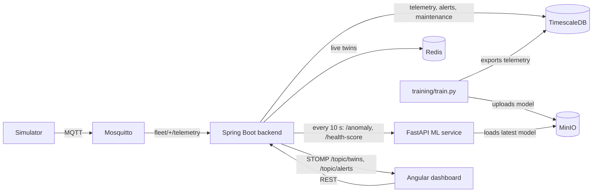

# Fleet Twin

A digital-twin based predictive fleet maintenance system. Simulated vehicles publish telemetry over
MQTT; the backend stores it, keeps a live twin of every vehicle, raises alerts from threshold rules
and from an anomaly model, and a dashboard shows it all in real time.

## Features

- **Digital twin** per vehicle: identity, location and heading, MOVING / IDLE / OFFLINE state, latest
  sensor values, a status for each component (engine, battery, brakes, four tyres, fuel system),
  health score and anomaly flag. Live state is in Redis; PostgreSQL keeps the history.
- **Alerts** from two sources: threshold rules (`RULE`) and the anomaly model (`ML`). The same open
  alert is never raised twice; an alert stays open until it is acknowledged.
- **Anomaly detection**: an XGBoost model over rolling-window features, trained on simulator data,
  stored in MinIO and served by the ML service with the top contributing features as reasons.
  See [docs/model_report.md](docs/model_report.md).
- **Dashboard**: fleet map, vehicle twin view with charts and anomaly markers, live alert feed.

## Architecture



More detail in [docs/architecture.md](docs/architecture.md).

```
fleet-twin/
  backend/      Spring Boot 3.5, Java 21, Maven
  frontend/     Angular 22
  ml-service/   Python 3.11, FastAPI, XGBoost; training scripts in ml-service/training
  simulator/    Python MQTT telemetry simulator
  infra/        docker-compose.yml, mosquitto config, db init scripts
  docs/         architecture notes, model report
```

## Prerequisites

| Tool | Version used |
|---|---|
| Java (JDK) | 21 |
| Maven | 3.9 |
| Node.js / npm | 24 / 11 |
| Angular CLI | 22 |
| Python | 3.11 (`python3.11` must be on the PATH) |
| Docker Desktop | running, with Compose v2+ |
| OpenMP runtime | macOS only, needed by XGBoost: `brew install libomp` |

## Ports

| Port | Service |
|---|---|
| 5432 | PostgreSQL / TimescaleDB |
| 1883 | Mosquitto (MQTT) |
| 9000 / 9001 | MinIO API / console |
| 6379 | Redis |
| 8080 | Backend |
| 8000 | ML service |
| 4200 | Frontend |

The four infra ports can be changed in `.env` (`POSTGRES_PORT`, `MQTT_PORT`, `MINIO_API_PORT`,
`MINIO_CONSOLE_PORT`, `REDIS_PORT`); the backend and simulator read the same file.

## First-time setup

```bash
cp .env.example .env          # then change the passwords
(cd ml-service && python3.11 -m venv .venv && .venv/bin/pip install -r requirements-dev.txt)
(cd simulator  && python3.11 -m venv .venv && .venv/bin/pip install -r requirements.txt)
(cd frontend   && npm ci)
```

`.env` is git-ignored. Every credential (Postgres, MQTT, MinIO, Redis) comes from it.

## Start and stop

Run each part in its own terminal, in this order.

### 1. Infrastructure

```bash
docker compose up -d          # from the repo root
docker compose ps             # every service should say "healthy"
docker compose down           # stop, keep data
docker compose down -v        # stop and delete all data volumes
```

### 2. Backend

```bash
cd backend
mvn spring-boot:run           # Ctrl+C to stop
```

- Health: http://localhost:8080/actuator/health
- Swagger UI: http://localhost:8080/swagger-ui.html
- Flyway creates the schema and seeds 5 vehicles (ids 1–5) on first start.
- Must be started from `backend/` so it finds `../.env`.

| Endpoint | Purpose |
|---|---|
| `GET /api/vehicles` | Every vehicle's twin |
| `GET /api/vehicles/{id}/twin` | One twin, plus its recent maintenance records |
| `GET /api/vehicles/{id}/telemetry?from=&to=&interval=` | Bucket averages via `time_bucket()`. `from`/`to` are ISO instants (default: last 15 minutes); `interval` is e.g. `10s`, `5m`, `1h` (default: about 300 points) |
| `GET /api/alerts?status=&vehicleId=&severity=&source=&from=&to=` | Newest first. `status` is `open` (default), `acknowledged` or `all` |
| `POST /api/alerts/{id}/acknowledge` | Acknowledge an alert |
| `GET/POST /api/maintenance-records`, `GET/PUT/DELETE /api/maintenance-records/{id}` | Maintenance CRUD; `GET` takes `?vehicleId=` |
| WebSocket `ws://localhost:8080/ws` (STOMP) | `/topic/twins` gets every twin update, `/topic/alerts` every new or acknowledged alert |

Everything tunable is in `backend/src/main/resources/application.yml` under `fleet`:
component threshold rules (`fleet.rules`), the offline timeout and moving speed (`fleet.twin`),
and the ML service URL, scoring interval, window and timeout (`fleet.ml`). If the ML service is
down the backend logs one warning per cycle and carries on with rule-based statuses.

### 3. ML service

```bash
cd ml-service
.venv/bin/uvicorn app.main:app --port 8000     # Ctrl+C to stop
```

Docs at http://localhost:8000/docs. It loads the newest model from MinIO at startup; until one has
been trained (see [Retraining the model](#retraining-the-model)) `/anomaly` returns 503 and the
backend falls back to health scores from component statuses alone.

| Endpoint | Purpose |
|---|---|
| `GET /health` | Status and the loaded model version |
| `POST /anomaly` | Takes one vehicle's recent readings (ideally the last 2 minutes), scores the newest. Returns `{ vehicle_id, is_anomaly, score, reasons[], model_version }` |
| `POST /health-score` | 100 minus 10 per WARNING component, 25 per CRITICAL component and 30 × anomaly score, floored at 0. Returns the score and the deductions |
| `POST /model/reload` | Load the newest model from MinIO without restarting |
| `POST /rul` | Placeholder until Phase 2 |

```bash
curl localhost:8000/health
curl -X POST localhost:8000/anomaly -H 'Content-Type: application/json' \
  -d '{"vehicle_id":1,"readings":[{"ts":"2026-10-06T10:00:00Z","engine_temp":118,"vibration":0.4}]}'
curl -X POST localhost:8000/health-score -H 'Content-Type: application/json' \
  -d '{"vehicle_id":1,"components":{"engine":"CRITICAL","battery":"OK"},"anomaly_score":0.9}'
```

The health score weights are env vars (`HEALTH_WARNING_PENALTY`, `HEALTH_CRITICAL_PENALTY`,
`HEALTH_ANOMALY_WEIGHT`), as are `MINIO_ENDPOINT` and `MODEL_BUCKET`. To run it as a container, give
it the MinIO settings: `docker build -t fleet-twin-ml ml-service && docker run --rm -p 8000:8000
--env-file .env -e MINIO_ENDPOINT=host.docker.internal:9000 fleet-twin-ml`.

### 4. Simulator

```bash
cd simulator
.venv/bin/python simulator.py                                   # Ctrl+C to stop
.venv/bin/python simulator.py --vehicles 5 --interval 2 --fault-rate 0.05
.venv/bin/python simulator.py --self-check                      # model assertions, no broker needed
```

Defaults come from `SIM_VEHICLES`, `SIM_INTERVAL` and `SIM_FAULT_RATE` in `.env`; CLI args win.
Only vehicle ids that exist in the `vehicles` table are stored, so keep `--vehicles` at 5 or
below until more vehicles are added.

Check that rows are arriving:

```bash
docker compose exec timescaledb psql -U fleettwin -d fleettwin -c "SELECT count(*) FROM telemetry;"
```

### 5. Frontend

```bash
cd frontend
npm start                     # http://localhost:4200, Ctrl+C to stop
```

- **Fleet Overview**: map with one marker per vehicle (arrow = heading; green / amber / red =
  health; faded = offline), summary cards, and a vehicle list. Click a vehicle to open it.
- **Vehicle detail**: health gauge, component tiles, charts with a 15 min / 1 h / 24 h selector and
  a vertical marker for each alert (solid purple = ML anomaly, dashed orange = rule alert),
  and the maintenance history with a form to add records.
- **Alerts**: live feed with filters and an acknowledge button.

The sidebar shows "Live" while the WebSocket is connected. Backend and WebSocket URLs, the health
colour bands, the chart refresh interval and the map tiles are in
`frontend/src/environments/environment.ts`.

## Retraining the model

Run the simulator for at least 45 minutes first (the export step tells you if there is too little
data), then from `ml-service/`:

```bash
.venv/bin/python -m training.export_data     # telemetry + injected_fault labels -> training/data/telemetry.csv
.venv/bin/python -m training.train           # trains both models, writes docs/model_report.md, uploads the better one
curl -X POST localhost:8000/model/reload     # or restart the ML service
```

`train.py` compares an Isolation Forest (unsupervised) with XGBoost (supervised) on a time-based
split and uploads the one with the higher F1 to MinIO as `models/anomaly/<UTC timestamp>/`. Each
run is a new version and the service always loads the newest. `--no-upload` trains and writes the
report only.

## Tests

```bash
(cd backend && mvn test)                                   # payload parsing, threshold rules, alert de-duplication
(cd ml-service && .venv/bin/python -m pytest)              # feature pipeline, /anomaly and /health-score
(cd simulator && .venv/bin/python simulator.py --self-check)
```

## Troubleshooting

- **`Cannot connect to the Docker daemon`**: Docker Desktop isn't running. Start it
  (`open -a Docker` on macOS) and wait for it to finish starting.
- **`port is already allocated` / `Address already in use`**: find the owner with
  `lsof -nP -iTCP:<port> -sTCP:LISTEN`. For infra ports, change the matching `*_PORT` in `.env` and
  re-run `docker compose up -d`. For the others: `SERVER_PORT=8081 mvn spring-boot:run` (and update
  `environment.ts`), `uvicorn ... --port 8001`, or `npm start -- --port 4201` (and add the new
  origin to `fleet.cors.allowed-origins` in `application.yml`).
- **A container stays `unhealthy`**: `docker compose logs <service>`.
- **Backend fails with `password authentication failed`**: Postgres only reads
  `POSTGRES_PASSWORD` when the data volume is first created. After changing it, run
  `docker compose down -v` (this deletes the data) and start again.
- **Backend fails with `Could not resolve placeholder 'POSTGRES_DB'`**: `.env` is missing, or the
  backend wasn't started from `backend/`.
- **Backend logs `Not authorized to connect` (MQTT)**: `MQTT_USERNAME`/`MQTT_PASSWORD` changed
  after Mosquitto started. `docker compose up -d --force-recreate mosquitto`.
- **Flyway `checksum mismatch`**: an applied migration file was edited. Add a new `V4__...sql`
  instead, or reset the dev database with `docker compose down -v`.
- **Simulator runs but the row count doesn't grow**: check the backend is running and look for
  `Dropped telemetry` in its log (unknown vehicle id or malformed JSON).
- **Frontend shows "Cannot reach the backend"**: the backend is down, or the page is served from an
  origin other than `http://localhost:4200` (CORS).
- **`XGBoost Library (libxgboost.dylib) could not be loaded`** (macOS): `brew install libomp`.
- **Vehicles have no health score / backend logs `ML service unavailable`**: the ML service isn't
  running on port 8000. Rule-based statuses and alerts keep working without it.
- **Backend logs `ML service has no anomaly model loaded`**: train one (see Retraining the model).
- **MinIO image**: MinIO no longer publishes official images to Docker Hub or Quay, so compose
  uses the Chainguard build pinned by digest. To upgrade, pull `cgr.dev/chainguard/minio:latest`
  and replace the digest in `infra/docker-compose.yml`.
