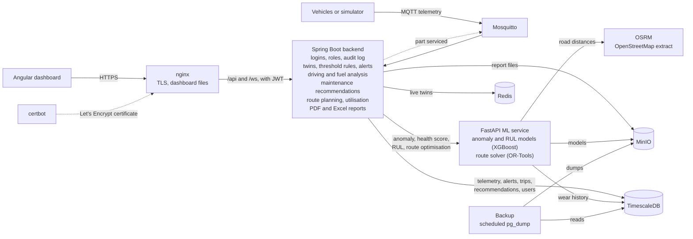

# Fleet Twin

A digital-twin based predictive fleet maintenance system. Simulated vehicles publish telemetry over
MQTT; the backend stores it, keeps a live twin of every vehicle, raises alerts from threshold rules
and from an anomaly model, predicts how long each part has left, scores driving and fuel use, and
turns all of that into maintenance recommendations, and plans delivery routes around the vehicles
that are fit to drive. A dashboard with role-based logins shows it in real time, and the whole stack
runs on one server behind HTTPS.

- Running it on a server: [docs/deployment.md](docs/deployment.md)
- Using the dashboard, by role: [docs/user-guide.md](docs/user-guide.md)
- What was built in each phase and why: [docs/project-summary.md](docs/project-summary.md)

## Features

- **Digital twin** per vehicle: identity, location and heading, MOVING / IDLE / OFFLINE state, latest
  sensor values, a status for each component (engine, battery, brakes, four tyres, fuel system),
  health score and anomaly flag. Live state is in Redis; PostgreSQL keeps the history.
- **Alerts** from two sources: threshold rules (`RULE`) and the anomaly model (`ML`). The same open
  alert is never raised twice; an alert stays open until it is acknowledged.
- **Anomaly detection**: an XGBoost model over rolling-window features, trained on simulator data,
  stored in MinIO and served by the ML service with the top contributing features as reasons.
  See [docs/model_report.md](docs/model_report.md).
- **Remaining useful life** for brake pads, battery, tyres and engine: days left with a lower and
  upper bound and a confidence, from per-component models trained on run-to-failure history.
- **Driver behaviour**: harsh braking, rapid acceleration, speeding, sharp cornering and excessive
  idling are detected from telemetry, telemetry is split into trips, and each trip and day gets a
  0–100 driver score from a published formula. See [docs/driver_score.md](docs/driver_score.md).
- **Fuel analysis**: efficiency per trip and day, fuel lost to idling, and two anomalies: fuel
  that disappears while parked (`FUEL_DROP`) and trips far below the vehicle's own baseline
  (`LOW_EFFICIENCY`).
- **Maintenance recommendations**: configurable rules combine RUL, component status, open alerts,
  anomaly history and time or distance since the last service. Each recommendation states its
  evidence in plain English. Completing one records the maintenance and resets the part's wear.
- **Route optimisation**: give it delivery stops (with optional time windows) and it assigns and
  orders them per vehicle with Google OR-Tools, using road distances from a self-hosted OSRM and
  straight-line distances when OSRM cannot help. Vehicles with an urgent recommendation, an open
  critical alert or a part close to failure are left out, and each exclusion is explained.
- **Utilisation**: hours on trips, idle time and distance per vehicle and for the fleet, with
  under- and over-used vehicles flagged.
- **Logins and roles**: JWT access and refresh tokens, BCrypt passwords, four roles (see
  [Roles](#roles)), a secured WebSocket, user management and an audit log of who did what.
- **Reports**: fleet health, maintenance, driver behaviour and fuel for any date range, as PDF or
  Excel, kept in MinIO with a list of past reports. Optional weekly email.
- **Dashboard**: fleet map, vehicle twin view with charts and anomaly markers, live alert feed,
  Maintenance Planner, Drivers & Fuel with utilisation, Route Planner, Reports, User Management.
- **Production setup**: Docker images for every service, one compose file behind nginx with
  Let's Encrypt, scheduled database backups to MinIO, CI on GitHub Actions, Prometheus metrics.

## Architecture



This is the production layout. In development the dashboard talks to the backend directly and
there is no nginx, certbot or backup container. The training scripts (`ml-service/training`) read
telemetry and maintenance history from TimescaleDB and upload versioned models to MinIO; the
simulator's fast-forward mode writes history straight to TimescaleDB. The data path in detail is
in [docs/architecture.md](docs/architecture.md).

```
fleet-twin/
  backend/      Spring Boot 3.5, Java 21, Maven
  frontend/     Angular 22
  ml-service/   Python 3.11, FastAPI, XGBoost; training scripts in ml-service/training
  simulator/    Python MQTT telemetry simulator
  infra/        development docker-compose.yml, mosquitto config, db init, backup image, Prometheus config
  docs/         architecture, deployment, user guide, project summary, model report, driver score formula
  docker-compose.prod.yml   the whole stack for one server (see docs/deployment.md)
  .github/workflows/ci.yml  tests on every push, image builds on main
```

## Prerequisites

| Tool | Version used |
|---|---|
| Java (JDK) | 21 |
| Maven | 3.9 |
| Node.js / npm | 22 or later (24 / 11 used) |
| Python | 3.11 (`python3.11` must be on the PATH; on Windows the `py -3.11` launcher works too) |
| Docker Desktop | running, with Compose v2+ |
| OpenMP runtime | macOS only, needed by XGBoost: `brew install libomp` |

## Ports

| Port | Service |
|---|---|
| 5432 | PostgreSQL / TimescaleDB |
| 1883 | Mosquitto (MQTT) |
| 9000 / 9001 | MinIO API / console |
| 6379 | Redis |
| 5001 | OSRM (5000 inside Docker; 5000 on a Mac belongs to AirPlay) |
| 8080 | Backend |
| 8000 | ML service |
| 4200 | Frontend |

These are the development ports. The infra ports can be changed in `.env` (`POSTGRES_PORT`,
`MQTT_PORT`, `MINIO_API_PORT`, `MINIO_CONSOLE_PORT`, `REDIS_PORT`, `OSRM_PORT`); the backend and
simulator read the same file. In production only 80 and 443 (nginx) are published, plus 8883 if
MQTT over TLS is switched on.

## First-time setup

One command checks the prerequisites, creates `.env` with generated passwords, installs every
dependency, starts the infrastructure, creates the database schema and the admin user, loads
90 days of simulated history and trains the remaining-life models. It takes about five minutes and
can be run again safely.

```bash
./setup.sh                    # macOS and Linux
.\setup.ps1                   # Windows (PowerShell); not yet run on a real Windows machine
```

Add `--no-data` (`-NoData` on Windows) to skip the simulated history. When it finishes it prints
the four commands of the next section; the dashboard login is `ADMIN_USERNAME` / `ADMIN_PASSWORD`
in `.env`.

<details>
<summary>The same by hand</summary>

```bash
cp .env.example .env
# Replace every change-me value in .env. The backend refuses to start with the example JWT_SECRET
# or ADMIN_PASSWORD. This does all of them at once:
python3.11 -c 'import pathlib, re, secrets; p = pathlib.Path(".env"); p.write_text(re.sub(r"change-me[\w-]*", lambda _: secrets.token_urlsafe(32), p.read_text()))'

(cd ml-service && python3.11 -m venv .venv && .venv/bin/pip install -r requirements-dev.txt)
(cd simulator  && python3.11 -m venv .venv && .venv/bin/pip install -r requirements.txt)
(cd frontend   && npm ci)
```

Then start the infrastructure and the backend as below, and load history as described under
[Simulator](#4-simulator).

</details>

`.env` is git-ignored. Every credential (Postgres, MQTT, MinIO, Redis, the JWT signing secret and
the first admin's password) comes from it; [docs/configuration.md](docs/configuration.md) lists
every setting. Set the passwords before the first `docker compose up`: PostgreSQL keeps the
password its data volume was created with.

## Start and stop

Run each part in its own terminal, in this order. This is the development setup; for a server see
[docs/deployment.md](docs/deployment.md).

### 1. Infrastructure

```bash
docker compose up -d          # from the repo root
docker compose ps             # every service should say "healthy"
docker compose down           # stop, keep data
docker compose down -v        # stop and delete all data volumes
```

The first start also downloads the OpenStreetMap extract named by `OSRM_PBF_URL` (Karnataka, 130 MB)
and prepares it for routing, which takes a minute or two and about 4 GB of memory. To use another
region, put the URL of any `.osm.pbf` extract (for example from
[download.geofabrik.de](https://download.geofabrik.de) or
[download.openstreetmap.fr/extracts](https://download.openstreetmap.fr/extracts/)) in `OSRM_PBF_URL`
and run `docker compose up -d` again: the container notices the change and prepares the new region.
Larger regions need more memory and time. Stops or vehicles outside the region still get a route,
from straight-line distances.

### 2. Backend

```bash
cd backend
mvn spring-boot:run           # Ctrl+C to stop
```

- Health: http://localhost:8080/actuator/health
- Swagger UI: http://localhost:8080/swagger-ui.html
- Flyway creates the schema and seeds 5 vehicles (ids 1–5) on first start.
- The first start also creates the admin user from `ADMIN_USERNAME` / `ADMIN_PASSWORD`. Later
  changes to those two variables do nothing; manage users in the dashboard.
- Must be started from `backend/` so it finds `../.env`.

Every endpoint except login, refresh and `/actuator/health` needs an access token:

```bash
TOKEN=$(curl -s -X POST localhost:8080/api/auth/login -H 'Content-Type: application/json' \
  -d '{"username":"admin","password":"<ADMIN_PASSWORD>"}' | python3 -c 'import sys,json; print(json.load(sys.stdin)["accessToken"])')
curl -H "Authorization: Bearer $TOKEN" localhost:8080/api/vehicles
```

In Swagger UI, click **Authorize** and paste the token.

| Endpoint | Purpose |
|---|---|
| `GET /api/vehicles` | Every vehicle's twin |
| `GET /api/vehicles/{id}/twin` | One twin, plus its recent maintenance records |
| `GET /api/vehicles/{id}/telemetry?from=&to=&interval=` | Bucket averages via `time_bucket()`. `from`/`to` are ISO instants (default: last 15 minutes); `interval` is e.g. `10s`, `5m`, `1h` (default: about 300 points) |
| `GET /api/alerts?status=&vehicleId=&severity=&source=&from=&to=` | Newest first. `status` is `open` (default), `acknowledged` or `all` |
| `POST /api/alerts/{id}/acknowledge` | Acknowledge an alert |
| `GET/POST /api/maintenance-records`, `GET/PUT/DELETE /api/maintenance-records/{id}` | Maintenance CRUD; `GET` takes `?vehicleId=` |
| `GET /api/vehicles/{id}/driver-score?period=` | Score, distance, event counts and a per-day breakdown. `period` is e.g. `24h`, `7d`, `30d` (default `7d`) |
| `GET /api/vehicles/{id}/trips?period=` | Trips, newest first: distance, duration, average and top speed, idling, fuel, events, score |
| `GET /api/vehicles/{id}/events?period=&type=` | Driving and fuel events, newest first (default `24h`); `type` is e.g. `HARSH_BRAKING`, `FUEL_DROP` |
| `GET /api/vehicles/{id}/fuel?period=` | km/l, l/100 km, idling litres, per-day breakdown, baseline and fuel anomalies |
| `GET /api/fleet/fuel-summary?period=` | One row per vehicle, fleet totals, the idling cost sentence and the score/efficiency correlation |
| `GET /api/recommendations?status=&priority=&vehicleId=` | Most urgent first, then by recommended-by date |
| `PATCH /api/recommendations/{id}` | Body `{"status": "SCHEDULED" \| "DONE" \| "DISMISSED" \| "OPEN"}`. `DONE` creates a maintenance record, resets the part's wear in the twin and tells the simulator |
| `POST /api/recommendations/recompute` | Run the recommendation rules now |
| `POST /api/admin/reanalyse?from=&to=` | Rebuild trips and events from stored telemetry (needed after a fast-forward) |
| `POST /api/routes/optimise` | Body `{ stops: [{name, lat, lng, windowStart?, windowEnd?, serviceMinutes?}], vehicleIds?, depot?: {lat, lng}, departAt?, returnToStart?, maxStopsPerVehicle? }`. Returns an ordered route per vehicle with arrival times, distance, time, estimated fuel and the line to draw; `excluded` vehicles with reasons; `unassigned` stops; and whether distances came from `osrm` or `straight-line` |
| `GET /api/fleet/utilisation?period=` | Active hours, idle hours, distance and utilisation per vehicle and for the fleet; `usage` is `UNDER_USED`, `NORMAL` or `OVER_USED` |
| `GET /api/vehicles/{id}/routes?period=` | Route history: per day, where the vehicle started and ended, distance, driving time, stops, events and fuel |
| `POST /api/reports` | Body `{ type: FLEET_HEALTH \| MAINTENANCE \| DRIVER_BEHAVIOUR \| FUEL, format: PDF \| XLSX, from, to }` (dates, `to` inclusive). Generates the file, stores it in MinIO and returns its entry |
| `GET /api/reports`, `GET /api/reports/{id}/download` | Past reports, newest first; download one |
| `POST /api/auth/login`, `/refresh`, `/logout`, `GET /api/auth/me` | Log in with `{username, password}` for `{accessToken, refreshToken, expiresIn, username, role}`; trade a refresh token for a new pair; end all of the user's sessions; who am I |
| `GET/POST /api/users`, `PATCH /api/users/{id}` | Admin: list and create users; change role, enable or disable, reset password |
| `GET /api/audit-log?limit=` | Admin: who acknowledged, completed, dismissed, created or changed what, newest first |
| `GET /api/admin/settings` | Admin: the thresholds, weights and schedules in force |
| WebSocket `ws://localhost:8080/ws` (STOMP) | `/topic/twins` gets every twin update, `/topic/alerts` every new or acknowledged alert. The `CONNECT` frame must carry `Authorization: Bearer <access token>` |

Everything tunable is in `backend/src/main/resources/application.yml` under `fleet`:
component threshold rules (`fleet.rules`), the offline timeout and moving speed (`fleet.twin`),
the ML service URL, scoring and RUL intervals, window and timeout (`fleet.ml`), driving event
thresholds and driver score weights (`fleet.driving`), fuel anomaly thresholds (`fleet.fuel`),
the recommendation schedule, priority rules, due dates and per-component actions
(`fleet.recommendations`), route planning (`fleet.routes`: the minimum remaining life for a route,
how much fuel efficiency and driver score count, how hard routes are balanced, solver time),
utilisation bands (`fleet.utilisation`), token lifetimes and password length (`fleet.security`)
and report settings (`fleet.reports`). If the ML service is down the backend logs one warning per cycle and
carries on: statuses, alerts, driver scores, fuel analysis and recommendations need only the
database (recommendations then lose their RUL evidence and use the rest). Route optimisation is the
exception: the solver lives in the ML service, so it answers 503 until that is back.

### Roles

| Role | Can do |
|---|---|
| `ADMIN` | Everything, including user management, the audit log and viewing the settings in force |
| `FLEET_MANAGER` | Every dashboard, route planning, recommendations, alerts, maintenance records, reports |
| `TECHNICIAN` | Vehicles, alerts, maintenance records and recommendations (read and write); no fleet analysis, routes or reports |
| `VIEWER` | Read-only: sees what a fleet manager sees, including past reports, and can change nothing |

The rules are in one place, `SecurityConfig`, and are tested in `SecurityRulesTest`. Access tokens
last 15 minutes and refresh tokens 7 days (`fleet.security`). Logging out, or any change to a
user, ends that user's refresh tokens; an access token already issued keeps working until it
expires. Thresholds are shown to admins but changed in `application.yml`, followed by a restart.

### 3. ML service

```bash
cd ml-service
.venv/bin/uvicorn app.main:app --port 8000     # Ctrl+C to stop
```

Docs at http://localhost:8000/docs. It loads the newest models from MinIO at startup; until they
have been trained (see [Retraining the models](#retraining-the-models)) `/anomaly` and `/rul`
return 503 and the backend falls back to health scores from component statuses alone.

| Endpoint | Purpose |
|---|---|
| `GET /health` | Status and the loaded anomaly and RUL model versions |
| `POST /anomaly` | Takes one vehicle's recent readings (ideally the last 2 minutes), scores the newest. Returns `{ vehicle_id, is_anomaly, score, reasons[], model_version }` |
| `POST /health-score` | 100 minus 10 per WARNING component, 25 per CRITICAL component and 30 × anomaly score, floored at 0. Returns the score and the deductions |
| `POST /model/reload` | Load the newest models from MinIO without restarting |
| `POST /optimise-routes` | Vehicle routing with OR-Tools: vehicles (start point, cost factor), stops (optional time window in seconds after departure, service time), returns ordered stops per vehicle, distance, duration and geometry. Uses OSRM at `OSRM_URL` (default `http://localhost:5001`), falling back to straight lines |
| `POST /rul` | Takes `{ vehicle_id, component }` (`brakes`, `battery`, `tyres` or `engine`), reads that vehicle's history from TimescaleDB. Returns `{ vehicle_id, component, rul_days, lower_bound, upper_bound, confidence, model_version }` |

```bash
curl localhost:8000/health
curl -X POST localhost:8000/anomaly -H 'Content-Type: application/json' \
  -d '{"vehicle_id":1,"readings":[{"ts":"2026-10-06T10:00:00Z","engine_temp":118,"vibration":0.4}]}'
curl -X POST localhost:8000/health-score -H 'Content-Type: application/json' \
  -d '{"vehicle_id":1,"components":{"engine":"CRITICAL","battery":"OK"},"anomaly_score":0.9}'
curl -X POST localhost:8000/rul -H 'Content-Type: application/json' \
  -d '{"vehicle_id":3,"component":"brakes"}'
```

The health score weights are env vars (`HEALTH_WARNING_PENALTY`, `HEALTH_CRITICAL_PENALTY`,
`HEALTH_ANOMALY_WEIGHT`), as are `MINIO_ENDPOINT`, `MODEL_BUCKET`, `RUL_HISTORY_DAYS` and
`RUL_CACHE_SECONDS`, and for routing `OSRM_URL`, `OSRM_MAX_SNAP_M`, `ROUTE_FALLBACK_SPEED_KMH` and
`ROUTE_FALLBACK_DETOUR`. `/rul` needs the `POSTGRES_*` settings from `.env`. The service has no
login of its own: only the backend should be able to reach it, which is how the production
compose file runs it.

### 4. Simulator

```bash
cd simulator
.venv/bin/python simulator.py                                   # Ctrl+C to stop
.venv/bin/python simulator.py --vehicles 5 --interval 2 --fault-rate 0.05
.venv/bin/python simulator.py --self-check                      # model assertions, no broker needed
```

Defaults come from `SIM_VEHICLES`, `SIM_INTERVAL` and `SIM_FAULT_RATE` in `.env`; CLI args win.
Only vehicle ids that exist in the `vehicles` table are stored, so keep `--vehicles` at 5 or
below until more vehicles are added.

Each vehicle has a driver profile (1 calm; 2 and 4 normal; 3 and 5 aggressive) that changes
braking, acceleration, speeding, idling and fuel use, and four parts that wear at their own rate:
brake pads, battery, tyres and engine. Short injected faults (overheating, vibration, low tyre
pressure, low battery, fuel theft) still occur at `--fault-rate`.

Fast-forward writes history straight to TimescaleDB instead of publishing live, including part
failures and the maintenance records that reset wear:

```bash
# stop the live simulator first (Ctrl+C), and start it again afterwards so it carries on from the new state
.venv/bin/python simulator.py --fast-forward 90 --replace --seed 42   # 90 days in a few seconds
# build trips, events and scores from it (admin only; TOKEN as under "Backend" above)
curl -X POST -H "Authorization: Bearer $TOKEN" localhost:8080/api/admin/reanalyse
```

`scripts/demo-reset.sh` does all of this, and retrains the models, starting from an empty database
(it asks first: it deletes the fleet data).

`--replace` first deletes existing telemetry, trips, events and maintenance records inside the
period; without it the run stops if any exist. The wear each vehicle ends on is saved to
`simulator/state.json` and live mode continues from it (`--fresh` ignores it). In live mode the
simulator also listens on `fleet/{id}/maintenance`, so completing a recommendation in the
dashboard resets that part in the simulator too.

Check that rows are arriving:

```bash
docker compose exec timescaledb psql -U fleettwin -d fleettwin -c "SELECT count(*) FROM telemetry;"
```

### 5. Frontend

```bash
cd frontend
npm start                     # http://localhost:4200, Ctrl+C to stop
```

Sign in with the admin from `.env`, then add other users under User Management. What each role
sees is described in [docs/user-guide.md](docs/user-guide.md).

- **Fleet Overview**: map with one marker per vehicle (arrow = heading; green / amber / red =
  health; faded = offline), summary cards, and a vehicle list. Click a vehicle to open it.
  Cards for urgent recommendations and the part with the lowest remaining life in the fleet.
- **Vehicle detail**: health gauge, component tiles, remaining-life bars with their likely range,
  that vehicle's recommendations, a driver score card with an event timeline, daily score and
  fuel efficiency charts, a trips table, telemetry charts with a 15 min / 1 h / 24 h selector and
  a vertical marker for each alert (solid purple = ML anomaly, dashed orange = rule alert),
  and the maintenance history with a form to add records.
- **Alerts**: live feed with filters and an acknowledge button.
- **Maintenance Planner**: every recommendation by priority and date, filters for status,
  priority and vehicle, and Schedule / Complete / Dismiss buttons.
- **Drivers & Fuel**: driver score ranking, fuel efficiency comparison, idling cost and utilisation.
- **Route Planner**: click the map to add stops, optionally set a depot and time windows, optimise,
  and see a coloured route per vehicle with a summary table and the vehicles that were left out.
- **Reports**: generate a report for a date range as PDF or Excel, download it, browse past ones.
- **User Management** (admin): users, roles, the audit log and the settings in force.

The sidebar shows "Live" while the WebSocket is connected. Backend and WebSocket URLs are in
`frontend/src/environments/environment.ts` (development) and `environment.prod.ts` (relative URLs
behind nginx). The health
colour bands, the remaining-life colour bands, the refresh intervals and the map tiles are in
`frontend/src/environments/settings.ts`.

## Retraining the models

### Anomaly model

Run the simulator for at least 45 minutes first (the export step tells you if there is too little
data), then from `ml-service/`:

```bash
.venv/bin/python -m training.export_data     # telemetry + injected_fault labels -> training/data/telemetry.csv
.venv/bin/python -m training.train           # trains both models, writes docs/model_report.md, uploads the better one
curl -X POST localhost:8000/model/reload     # or restart the ML service
```

`train.py` compares an Isolation Forest (unsupervised) with XGBoost (supervised) on a time-based
split and uploads the one with the higher F1 to MinIO as `models/anomaly/<UTC timestamp>/`. Each
run is a new version and the service always loads the newest. `--no-upload` trains and writes the
report only.

### Remaining useful life models

These need run-to-failure history, which the fast-forward mode provides (see
[Simulator](#4-simulator)). Then from `ml-service/`:

```bash
.venv/bin/python -m training.train_rul       # reads TimescaleDB, rewrites the RUL section of docs/model_report.md, uploads
curl -X POST localhost:8000/model/reload
```

For each of the four components it compares linear extrapolation of the wear reading with XGBoost
quantile regression, using leave-one-vehicle-out cross-validation, and uploads the one with the
lower MAE as `models/rul/<component>/<UTC timestamp>/`. The latest run (90 days, 5 vehicles):

| Component | Selected | MAE (days) | RMSE | Within ±7 days |
|---|---|---|---|---|
| brakes | XGBoost | 2.10 | 3.03 | 94% |
| battery | XGBoost | 1.81 | 2.79 | 95% |
| tyres | XGBoost | 3.41 | 5.20 | 83% |
| engine | XGBoost | 2.30 | 3.25 | 94% |

The baseline numbers, the interval method and the caveats are in
[docs/model_report.md](docs/model_report.md).

## Tests

```bash
(cd backend && mvn test)                                   # unit tests: fast, nothing else needs to run
(cd backend && mvn verify)                                 # + integration tests and the coverage report (needs Docker)
(cd ml-service && .venv/bin/python -m pytest --cov=app)    # ML service tests with coverage
(cd simulator && .venv/bin/python simulator.py --self-check)
(cd e2e && npm ci && npx playwright install chromium && npx playwright test)   # browser tests against the running stack
```

| Suite | What it covers | Needs |
|---|---|---|
| Backend unit tests (`*Test.java`) | Payload parsing, threshold rules, alert de-duplication, driving and fuel analysis, recommendation rules, route eligibility, utilisation, the access rules per role, report rendering | Nothing |
| Backend integration tests (`ApiIT`) | Every endpoint against real TimescaleDB, Redis, Mosquitto and MinIO started by Testcontainers: MQTT telemetry to twin and alert, recommendations, maintenance, trips and fuel, routes, reports, users, tokens, the WebSocket login. The ML service is a stand-in that can be switched off | Docker |
| ML service tests | Features, both anomaly model kinds, model storage, `/anomaly`, `/health-score`, `/rul`, route optimisation and the OSRM fallback | Nothing |
| End-to-end tests (`e2e/`) | A real browser doing each role's journeys: sign in, Fleet Overview, a vehicle, acknowledging an alert, completing a recommendation, planning routes, generating and downloading a report, managing users | The stack running with data in it |

Coverage: `backend/target/site/jacoco/index.html` after `mvn verify` (93% of lines), and the table
`pytest --cov` prints (94%). The end-to-end tests read the admin login from `.env`, create their own
`e2e-*` users, and change data the way a user would: one alert is acknowledged and one
recommendation completed per run. To point them at another stack, see `e2e/playwright.config.ts`.

GitHub Actions (`.github/workflows/ci.yml`) runs all of this on every push: the three test suites
with coverage, the frontend build, a check of the compose files, and the end-to-end tests against
the production stack built from that commit. On `main` it also builds the five Docker images.

## Code style

Formatting and linting are checked in CI. To check or fix locally:

| Code | Check | Fix |
|---|---|---|
| Java | `(cd backend && mvn spotless:check)` | `mvn spotless:apply` (unused imports, import order, whitespace) |
| Python | `ruff check . && black --check .` from the repository root (`pip install ruff black`; settings in `pyproject.toml`) | `ruff check --fix . && black .` |
| TypeScript, CSS | `(cd frontend && npm run lint && npm run format:check)` | `npm run format` (Prettier), `npx ng lint --fix` (ESLint) |

Every setting and its default is listed in [docs/configuration.md](docs/configuration.md).

## Troubleshooting

- **`Cannot connect to the Docker daemon`**: Docker Desktop isn't running. Start it
  (`open -a Docker` on macOS) and wait for it to finish starting.
- **`port is already allocated` / `Address already in use`**: find the owner with
  `lsof -nP -iTCP:<port> -sTCP:LISTEN`. For infra ports, change the matching `*_PORT` in `.env` and
  re-run `docker compose up -d`. For the others: `SERVER_PORT=8081 mvn spring-boot:run` (and update
  `environment.ts`), `uvicorn ... --port 8001`, or `npm start -- --port 4201` (and add the new
  origin to `fleet.cors.allowed-origins` in `application.yml`).
- **A container stays `unhealthy`**: `docker compose logs <service>`.
- **A new checkout shows old data, or `password authentication failed` on a machine that ran the
  project before**: Docker Compose names volumes after the folder (`<folder>_timescale-data`), so a
  checkout in a folder with the same name picks up the earlier one's database. `docker volume ls`
  shows them; use a differently named folder, or remove the old volumes if you no longer want them.
- **Backend fails with `JWT_SECRET still has its example value`**: `.env` still has the
  `change-me` placeholders. See First-time setup.
- **Backend fails with `password authentication failed`**: Postgres only reads
  `POSTGRES_PASSWORD` when the data volume is first created. After changing it, run
  `docker compose down -v` (this deletes the data) and start again.
- **Backend fails with `Could not resolve placeholder 'POSTGRES_DB'`**: `.env` is missing, or the
  backend wasn't started from `backend/`.
- **Backend logs `Not authorized to connect` (MQTT)**: `MQTT_USERNAME`/`MQTT_PASSWORD` changed
  after Mosquitto started. `docker compose up -d --force-recreate mosquitto`.
- **Flyway `checksum mismatch`**: an applied migration file was edited. Add a new `V4__...sql`
  instead (use the next free version number), or reset the dev database with `docker compose down -v`.
- **Simulator runs but the row count doesn't grow**: check the backend is running and look for
  `Dropped telemetry` in its log (unknown vehicle id or malformed JSON).
- **Backend fails with `Could not resolve placeholder 'JWT_SECRET'`** or says it must be at least
  32 characters: add `JWT_SECRET` to `.env` (see `.env.example`).
- **Nobody can log in / backend logs `There are no users and ADMIN_USERNAME / ADMIN_PASSWORD are
  not set`**: set both in `.env` and restart the backend. They only work while there are no users.
- **Every request answers 401 after a backend restart with a new `JWT_SECRET`**: old tokens no
  longer verify. Log in again.
- **Route Planner says distances are a straight-line estimate**: OSRM is still preparing its map
  (`docker compose logs osrm`), is down, or a stop or vehicle is outside its region. The note under
  the routes says which.
- **Route Planner says no vehicle is fit to be assigned**: every vehicle has an urgent
  recommendation, an open critical alert or a part under `fleet.routes.min-rul-days`. The reasons
  are listed; acknowledging alerts and completing recommendations frees vehicles up.
- **Report generation answers 503**: MinIO is unreachable (`docker compose ps`).
- **Frontend shows "Cannot reach the backend"**: the backend is down, or the page is served from an
  origin other than `http://localhost:4200` (CORS).
- **`XGBoost Library (libxgboost.dylib) could not be loaded`** (macOS): `brew install libomp`.
- **Vehicles have no health score / backend logs `Anomaly scoring skipped this cycle`**: the ML service isn't
  running on port 8000. Rule-based statuses and alerts keep working without it.
- **Backend logs `ML service has no anomaly model loaded`**: train one (see Retraining the models).
- **No remaining-life bars on a vehicle**: the ML service is down or has no RUL models (`curl
  localhost:8000/health` lists them). Fast-forward history and run `training.train_rul`.
- **Driver scores, trips or fuel figures are empty after a fast-forward**: run
  `curl -X POST -H "Authorization: Bearer $TOKEN" localhost:8080/api/admin/reanalyse` as an admin.
- **MinIO image**: MinIO no longer publishes official images to Docker Hub or Quay, so compose
  uses the Chainguard build pinned by digest. To upgrade, pull `cgr.dev/chainguard/minio:latest`
  and replace the digest in `infra/docker-compose.yml`.
