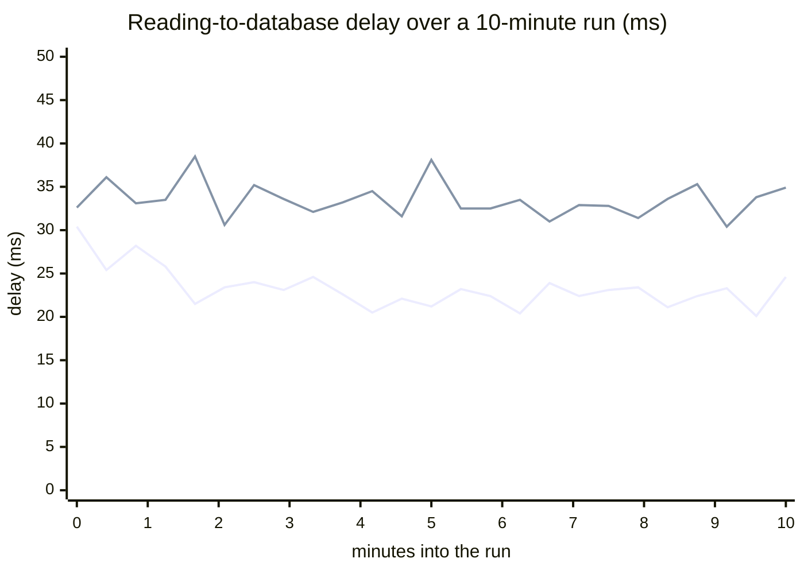
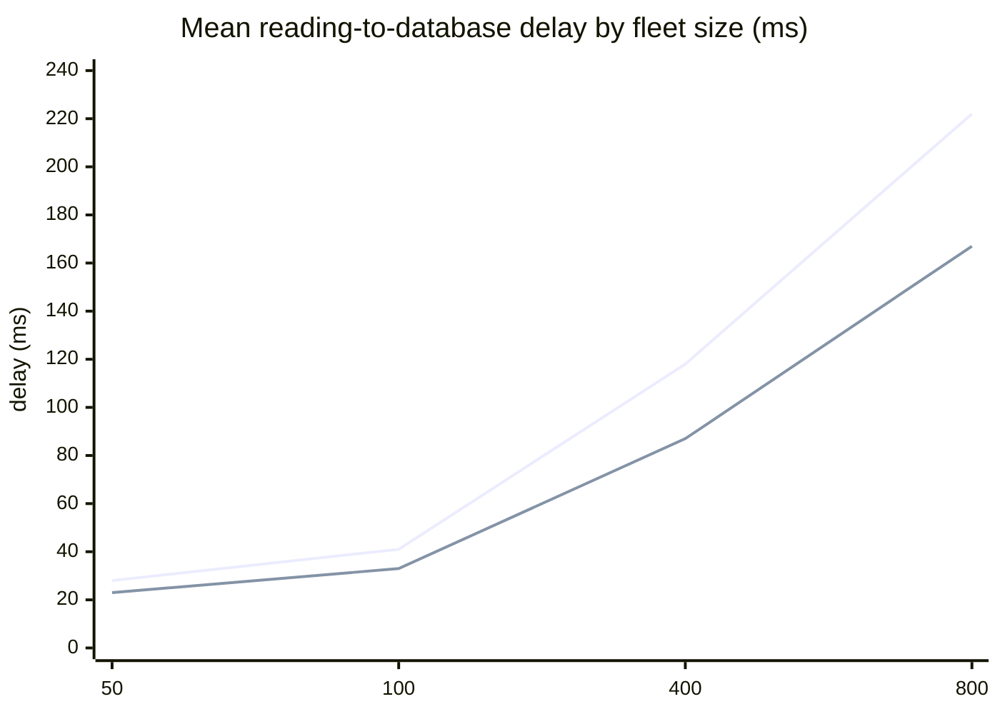
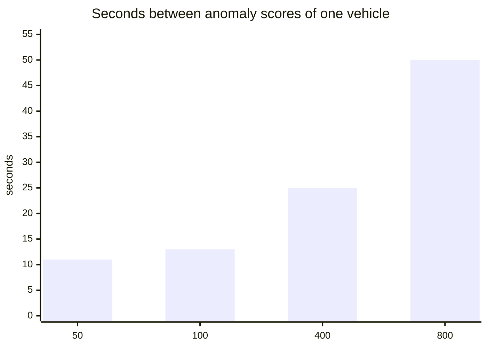

# Performance and reliability

How Fleet Twin behaves under load and when parts of it fail: what was measured, where it starts to
slow down, what was changed as a result, and what was measured again afterwards.

## Summary

- **The required load is easy.** 50 and 100 vehicles reporting every second for 10 minutes each:
  every reading stored, in the database and the twin about 25 to 35 ms after the vehicle took it,
  the dashboard at 60 frames a second, the backend using a twentieth of one CPU core.
- **Ingestion kept up to the highest load tried, 800 readings a second.** Delay grows in
  proportion to fleet size because readings are processed one at a time. Extrapolating the
  measured cost per reading puts the ceiling at roughly 2,300 readings a second.
- **The first thing to fall behind is anomaly scoring**: it is one call per vehicle, about 20 ms
  each, one after another. Each vehicle is scored every 13 seconds at 100 vehicles, every 25 at
  400 and every 50 at 800, against a target of 10. This is the system's practical
  scaling limit, and it was **not** fixed (two attempts made it worse; see below).
- **Four bottlenecks were fixed**: delay fell by 20 to 25%, and the vehicle list is 2 to 6 times
  faster.
- **Failure tests found one real defect**, now fixed: with Redis down, ingestion stalled and about
  5,300 readings were lost in a minute. After the fix nothing is lost.
- With the ML service down or the broker down the system degrades as designed and recovers by
  itself when the service returns.

## How it was measured

**Environment.** An isolated copy of the production stack (`docker-compose.prod.yml`, its own
volumes) on one laptop: Apple M4 Pro, 24 GB of memory, Docker Desktop with 14 CPUs and 11.7 GB.
The simulator runs in the same Docker network with a fresh fleet, the trained anomaly and
remaining-life models are loaded, and all requests go through nginx over HTTPS. Absolute numbers
belong to this machine; a small cloud server will be slower. The runs after the fixes were made
on battery power, the earlier ones on mains, which if anything understates the improvement.

**Load.** N simulated vehicles each publish one reading a second over MQTT (QoS 1). 50 and 100
vehicles ran for 10 minutes each; 200, 400 and 800 for 3 minutes each to find where things bend.

**Measurements**, sampled every 10 seconds by `scripts/loadtest/collect.py`:

| Measure | How |
|---|---|
| Ingestion rate | Readings stored per second (a counter in the backend) |
| Reading-to-database delay | Time from the timestamp the vehicle put on a reading to the row being committed. Recorded by the backend for every reading (`fleet_telemetry_stored_delay_seconds`). It includes the simulator's own publishing time and the broker |
| Reading-to-twin delay | The same, up to the twin being written to Redis and pushed to browsers |
| ML response times | Per endpoint, as timed by the backend's HTTP client |
| Anomaly scoring rate | Vehicles scored per second |
| Dashboard API | Response times of four requests the dashboard makes, through nginx |
| Dashboard in a browser | Headless Chrome on Fleet Overview for 20 seconds half-way through each run: frames per second, main-thread long tasks, time to open pages (`e2e/tools/dashboard-load.mjs`) |
| CPU and memory | `docker stats` per container |

The same measurements are permanently available at `/actuator/prometheus` for a monitored
deployment. To repeat the tests: `scripts/loadtest/run.sh` (the header explains the three steps).

One lesson about the method: the first baseline was ruined by the laptop going to sleep with its
lid closed, which looks exactly like a system that has stopped coping. Each run reported here was
checked against the operating system's sleep log.

## Results at 50 and 100 vehicles (10 minutes each)

| | 50 vehicles, before | 50, after fixes | 100 vehicles, before | 100, after fixes |
|---|---|---|---|---|
| Readings stored per second | 49.5 | 49.6 | 98.9 | 99.0 |
| Reading to database, mean (ms) | 28 | 23 | 41 | 33 |
| Reading to database, 95th percentile (ms) | 48 | 40 | 71 | 59 |
| Reading to database, 99th percentile (ms) | 52 | 46 | 84 | 67 |
| Reading to twin, mean (ms) | 28 | 24 | 41 | 34 |
| Twin updates pushed to each browser per second | 55 | 56 | 108 | 108 |
| `/anomaly`, mean per call (ms) | 18.8 | 19.9 | 18.6 | 20.3 |
| `/health-score`, mean per call (ms) | 1.8 | 1.8 | 1.8 | 1.8 |
| `/rul`, mean per call (ms) | 13.7 | 16.6 | 13.8 | 15.6 |
| Vehicle list (`GET /api/vehicles`), median (ms) | 16 | 9 | 16 | 8 |
| Alerts list, median (ms) | 6 | 7 | 6 | 7 |
| Telemetry history of one vehicle, median (ms) | 5 | 7 | 6 | 6 |
| Fleet fuel summary, median (ms) | 30 | 32 | 30 | 34 |
| Browser: sign-in to map drawn (ms) | 239 | 233 | 220 | 218 |
| Browser: frames per second | 60 | 60 | 60 | 60 |
| Browser: main thread blocked | 0% | 0% | 0% | 0% |
| Browser: open Alerts / open a vehicle (ms) | 111 / 162 | 122 / 149 | 120 / 132 | 110 / 162 |
| Samples with any error | 0 | 0 | 0 | 0 |

The simulator sleeps one second between rounds, so a round takes slightly longer than a second:
49.5 and 99 readings a second are everything it sent. Nothing was dropped.

Delay over the two 10-minute runs after the fixes (lower line: 50 vehicles; upper: 100). It is
flat: nothing accumulates.

### CPU and memory per container (after the fixes)

Mean / peak CPU, as a percentage of one core:

| Container | 50 vehicles | 100 | 400 | 800 |
|---|---|---|---|---|
| backend | 7 / 19 | 5 / 19 | 17 / 36 | 29 / 77 |
| ml-service | 18 / 75 | 12 / 83 | 42 / 84 | 61 / 84 |
| timescaledb | 6 / 37 | 6 / 39 | 20 / 65 | 30 / 50 |
| redis | 1 / 2 | 1 / 3 | 2 / 4 | 3 / 4 |
| mosquitto | 0 / 2 | 0 / 2 | 1 / 1 | 1 / 2 |
| nginx | 0 / 3 | 1 / 4 | 1 / 3 | 0 / 3 |
| minio | 0 / 1 | 1 / 8 | 0 / 3 | 0 / 3 |

Peak memory (MB):

| Container | 50 vehicles | 100 | 400 | 800 |
|---|---|---|---|---|
| backend | 577 | 608 | 651 | 774 |
| ml-service | 211 | 214 | 230 | 238 |
| timescaledb | 85 | 110 | 134 | 185 |
| minio | 165 | 152 | 152 | 151 |
| nginx | 20 | 21 | 21 | 20 |
| redis | 12 | 12 | 13 | 14 |
| mosquitto | 4 | 4 | 4 | 5 |

At the required load the whole stack fits in about 1 GB and uses well under half a core.

## Where it slows down

| Vehicles (one reading a second each) | 50 | 100 | 200 | 400 | 800 |
|---|---|---|---|---|---|
| Readings stored per second | 49.5 | 98.9 | 197 | 394 | 777 |
| Reading to database, mean (ms), before fixes | 28 | 41 | 66 | 118 | 222 |
| Reading to database, mean (ms), after fixes | 23 | 33 | – | 87 | 167 |
| Reading to database, 95th percentile (ms), after | 40 | 59 | – | 159 | 319 |
| Vehicles scored for anomalies per second, after | 4.4 | 7.6 | – | 16.0 | 15.9 |
| So each vehicle is scored every (s) | 11 | 13 | – | 25 | 50 |
| Vehicle list, median (ms), before / after | 16 / 9 | 16 / 8 | 25 / – | 78 / 13 | 66 / 19 |
| Fleet fuel summary, median (ms), after | 32 | 34 | – | 185 | 177 |
| Browser frames per second, after | 60 | 60 | – | 60 | 60 |

(200 vehicles was measured before the fixes only.)

Upper line: before the fixes. Lower line: after.

The target for the second chart is 10 seconds. Three things happen as the fleet grows.

**1. Delay grows in step with the fleet, and ingestion keeps up.** Readings are handled one at a
time on the MQTT subscriber thread: store the row, update the twin, feed the trip detector. The
simulator sends a whole fleet's readings in one burst each second, so the last reading of a burst
waits for all the others. From the mean delay, one reading cost about 0.57 ms before the fixes and
0.43 ms after, which puts the point where a burst no longer drains within its second at roughly
1,750 and 2,300 readings a second. That ceiling was not reached: at 800 a second there was no
backlog and no loss. Real vehicles do not report in synchronised bursts, so their delays at the
same rate would be lower.

**2. Anomaly scoring falls behind first.** Every 10 seconds the backend scores each online vehicle:
it fetches the vehicle's last two minutes of readings and calls `/anomaly` (about 20 ms) and
`/health-score` (2 ms), one vehicle after another, then waits 10 seconds and starts again. Up to
about 100 vehicles the pass is short and each vehicle is scored every 11 to 13 seconds. At 400
vehicles a pass takes 15 seconds, at 800 about 40, on top of which the minute-by-minute
remaining-life refresh for every vehicle (four calls of about 15 ms each) competes for the same
single ML process, which is running at 60% of a core by then. Nothing breaks: alerts from threshold
rules are raised on the reading itself and are unaffected. But an anomaly that only the model would
catch is noticed up to 50 seconds late instead of 10.

**3. The dashboard holds.** After the fixes the vehicle list takes 19 ms for 800 vehicles and the
browser stays at 60 frames a second with no long tasks. The fleet fuel summary grows to about
180 ms at 800 vehicles (it runs one query per vehicle); that is a page people open occasionally,
and it was left alone.

## What was changed

| Bottleneck | Evidence | Change | Effect |
|---|---|---|---|
| Storing a reading ran a SELECT before every INSERT | Spring Data's `save` on an entity with an assigned key checks for an existing row first | Telemetry rows declare themselves new, so `save` is a plain INSERT. A duplicate delivery now fails on the primary key and is dropped | Part of the 20–25% lower delay |
| Each twin update read the vehicle's identity from PostgreSQL | One query per reading for five fields that never change at run time | Identity is cached in memory per vehicle | The rest of that 20–25% |
| The vehicle list read each twin from Redis separately | Response time grew with the fleet: 78 ms at 400 vehicles | One `MGET` for all twins | 78 → 13 ms at 400 vehicles, 66 → 19 ms at 800 |
| The browser redrew once per twin update | Hundreds of list rebuilds and map redraws a second on a large fleet; 51 frames a second in the first 800-vehicle run | Updates are collected and applied together four times a second (`twinFlushMs`) | 60 frames a second at 800 vehicles |

Connection pools and indexes were looked at and left alone: ingestion is single-threaded and so
uses one database connection at a time, and every query on the hot path uses the primary key or
an existing index. Batching inserts was considered and rejected: it would raise the
ceiling, but at the cost of holding readings back, and the ceiling is already far above the load
this system is meant for.

### What was tried and withdrawn

Two attempts to speed up anomaly scoring made it slower. They are recorded here because they are
the obvious things to try.

- **Scoring four vehicles at a time from the backend.** The ML service is a single Python process
  and scoring is CPU-bound, so parallel requests simply queue inside it: each call took 130 ms
  instead of 20, and throughput at 400 vehicles fell from 15 to 9 vehicles a second.
- **Running the ML service with two worker processes** (`uvicorn --workers 2`). Every keep-alive
  request then took a fixed 40 ms longer, including a trivial one that takes 0.4 ms with one
  worker. This was reproduced in isolation; it has the signature of Nagle's algorithm meeting
  delayed acknowledgements, which suggests the multi-worker mode does not set `TCP_NODELAY` on
  its connections.

Both changes were removed. Scaling scoring properly means either running several single-process
ML containers behind a load balancer, or one batched request per scoring pass instead of one per
vehicle. Either is a design change rather than a fix, and belongs with future work. Until then the
levers are in `application.yml`: `fleet.ml.interval-ms` and `fleet.ml.rul-interval-ms` (remaining
life changes by the day, so refreshing it every minute is generous for a large fleet).

## Failure tests

100 vehicles reporting every second, with one service stopped for a minute at a time
(`scripts/loadtest/failures.sh`), sampled every 5 seconds.

| Stopped | While it was down | When it came back |
|---|---|---|
| **ML service** | Ingestion, twins, rule alerts and the dashboard unaffected (98 readings a second stored, delay unchanged). Health scores, anomaly flags and remaining-life values stay at their last values. One warning per scoring pass in the log | Scoring resumed on the next pass, within 10 seconds, with no action |
| **Redis**, before the fix | **Ingestion stalled**: 12 readings a second instead of 100, the vehicle list timed out after 20 seconds | A backlog arrived up to 45 seconds late, and about 5,300 of the 6,000 readings from that minute were never stored |
| **Redis**, after the fix | Every reading stored (98 a second, delay unchanged). Twins cannot be updated: the vehicle list answers with an error at once and the dashboard shows it; alerts, telemetry history and maintenance pages still work. One warning every 10 seconds with a count | The next reading of each vehicle rebuilds its twin; back to normal within a second |
| **MQTT broker** | No readings arrive, so none are stored; after 30 seconds the vehicles show as offline. The backend and the dashboard stay up | The backend reconnected and resubscribed by itself; 93 readings a second within 30 seconds. The minute of readings published into the void is lost: the simulator does not buffer. A real device should, and with QoS 1 and a persistent session the broker would hold them |

Readings stored per second through the test, before and after the Redis fix:

| Phase | Before | After |
|---|---|---|
| Normal | 101 | 98 |
| ML service down | 99 | 98 |
| ML service back | 98 | 99 |
| Redis down | **12** | **98** |
| Redis back | 95, arriving up to 45 s late | 99 |
| Broker down | 0 | 5 (the seconds before the stop took effect) |
| Broker back, first 30 s | 90 | 93 |
| Broker back, later | 98 | 100 |

**The Redis defect.** The architecture notes said a twin failure can never cost telemetry, because
the row is stored first. That was true for an error and false for a wait: the Redis client's
default is to queue commands while disconnected and wait up to a minute for the server to return,
and it waited on the one thread that stores telemetry. The fix has three parts: commands are
rejected immediately while Redis is unreachable, a Redis call that does answer may take at most
500 ms (`REDIS_TIMEOUT`), and the warning this produces for every reading is logged once every
10 seconds with a count rather than a hundred times a second. An integration test now stops Redis
and checks that readings keep being stored. A Redis that is reachable but hangs would still slow
ingestion to two readings a second; that case was not tested.

## Limits of these tests

- One machine ran the stack, the simulator and the measuring tools; they share its CPUs.
- The simulated vehicles report in a synchronised burst, which is the worst case for delay.
- The database started nearly empty. Ten minutes at 100 vehicles adds 60,000 rows; behaviour with
  hundreds of millions of rows (months of a large fleet) was not tested, and TimescaleDB
  compression and retention are not configured.
- A single browser was connected. Each additional dashboard user receives every twin update.
- Runs were 3 to 10 minutes: long enough to see steady state, not to find slow leaks.
