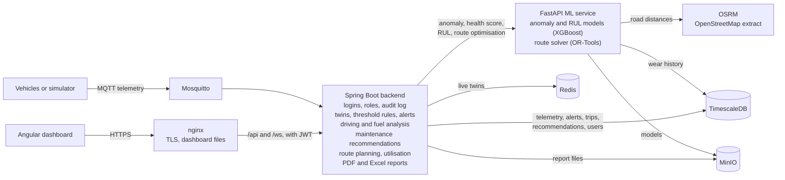

# Digital-Twin-Enabled Smart Fleet Management: project report

## 1. Introduction and problem statement

Commercial vehicle fleets are maintained in one of two ways. *Reactive* maintenance repairs a
vehicle after it fails, which is cheap until the failure happens on the road with a load on board.
*Scheduled* maintenance replaces parts at fixed intervals, which avoids most breakdowns but throws
away parts with life left in them and still misses the vehicle that wears faster than average
because of how or where it is driven.

Most fleets already collect telemetry from their vehicles: position, speed, engine temperature,
battery voltage, fault codes. In practice it is used for tracking and little else. The information
needed to do better (which part of which vehicle is degrading, how fast, and what that should
change about tomorrow's plan) is in that stream, but it is not turned into decisions.

This project builds a system that does that. It keeps a *digital twin* of every vehicle, a live
software model fed by the vehicle's telemetry, and layers on top of it fault detection, prediction
of each component's remaining useful life, analysis of driving and fuel use, maintenance
recommendations that a person can act on, and route planning that takes vehicle health into
account. The result is a working, tested, deployable application called Fleet Twin.

## 2. Objectives

| | Objective | Outcome |
|---|---|---|
| **O1** | Build a real-time digital twin of each vehicle from its telemetry, and monitor the fleet's condition live | A twin per vehicle updated within tens of milliseconds of each reading, with component statuses, alerts and a live dashboard |
| **O2** | Predict failures before they happen and turn the predictions into maintenance decisions | An anomaly model (F1 0.98 on simulated faults), remaining-useful-life models (error of 2–3 days), and a rule engine that produces explained, prioritised recommendations |
| **O3** | Optimise how the fleet is operated, and make the system usable by an organisation | Driver scoring, fuel analysis, health-aware route optimisation, utilisation; role-based access, reports, single-server deployment |

## 3. Background

**Digital twins.** A digital twin is a virtual representation of a physical asset that is kept in
step with it through data and is used to understand or predict the asset's behaviour. The idea
comes from product lifecycle management and aerospace, where a twin of each aircraft or engine
accompanies it through its life. What separates a twin from a dashboard is that the twin is a
*model* of one specific asset with state, not a view of recent measurements: it remembers that this
vehicle's brake pads were replaced three weeks ago and what has happened to them since.

**Predictive maintenance.** Condition-based and predictive maintenance replace the fixed schedule
with an estimate of each component's actual condition. Two related problems are usually
distinguished. *Anomaly detection* asks whether the asset is behaving abnormally now; it can be
unsupervised (learn what normal looks like and flag departures, for example with an Isolation
Forest) or supervised when labelled faults exist. *Prognostics* asks how long a component has
left, its *remaining useful life* (RUL). RUL models are trained on *run-to-failure* histories, and
a recurring theme of the prognostics literature is that a point estimate is of little use without
a statement of its uncertainty, because the decision it supports (replace now or later) depends on
the risk of being wrong.

**Gradient-boosted trees.** For tabular sensor features, gradient-boosted decision trees such as
XGBoost are a strong and well-understood baseline: they need little tuning, handle missing values,
and their predictions can be attributed to input features with TreeSHAP, which matters when a
person has to trust an alert. Quantile regression with the same models gives prediction intervals,
and *conformal* calibration corrects those intervals to the coverage actually observed on held-out
data.

**Driver behaviour and fuel.** Telematics-based driver scoring (harsh braking, rapid
acceleration, speeding, cornering, idling) is established practice in fleet management and
usage-based insurance. Harsh driving is consistently associated with higher fuel consumption and
faster wear, which is why this project treats driver behaviour as an input to maintenance and
routing rather than as a separate topic.

**Vehicle routing.** Assigning delivery stops to vehicles and ordering them is the *vehicle
routing problem* (VRP), a generalisation of the travelling salesman problem that is NP-hard.
Practical solvers combine construction heuristics with local search and metaheuristics; Google's
OR-Tools is a widely used open-source implementation that supports time windows and per-vehicle
costs. Real road distances come from a routing engine; OSRM is an open-source one built on
OpenStreetMap data. What the usual formulation leaves out, and this project adds, is the health of
the vehicles being assigned.

**The gap.** Each of these pieces exists on its own. The contribution of this project is their
integration: one system in which a prediction about a brake pad changes a recommendation, a
technician's action resets the model's view of that part, and the route planner declines to send
a vehicle whose battery is about to fail.

## 4. System architecture

| Component | Technology | Responsibility |
|---|---|---|
| Vehicles | Python simulator publishing MQTT | Telemetry every 2 seconds per vehicle |
| Message broker | Mosquitto | Decouples vehicles from the backend |
| Backend | Java 21, Spring Boot 3.5 | Ingestion, twins, rules, alerts, analysis, recommendations, security, reports, REST and WebSocket API |
| Time-series store | TimescaleDB (PostgreSQL 16) | Telemetry hypertable and all relational data |
| Twin store | Redis | The current twin of each vehicle, as JSON |
| ML service | Python 3.11, FastAPI, XGBoost, OR-Tools | Anomaly scores, health score, RUL, route optimisation |
| Road router | OSRM | Distance and time matrices, route geometry |
| Object store | MinIO | Versioned models, generated reports, database backups |
| Dashboard | Angular 22, Leaflet, ECharts | Nine pages, updated live over STOMP/WebSocket |
| Edge | nginx, Let's Encrypt | TLS, static files, reverse proxy, rate limiting |

Design decisions that shaped the system (the full list is in [architecture.md](architecture.md)):

- **The telemetry row is stored before anything else happens**, and every later step (twin, driving
  analysis) can fail without losing it. Derived data such as trips and driving events can always be
  rebuilt from telemetry.
- **Machine learning is a separate, optional service.** The backend calls it on a schedule with
  short timeouts and treats every failure as "skip this cycle". Rules, alerts, driver scores, fuel
  analysis and recommendations work without it.
- **Explanations are first-class.** Anomalies come with the features that drove them,
  recommendations with their evidence in a sentence, excluded vehicles with the reason.
- **Rules are configuration, not code.** Every threshold, weight, interval and schedule is in one
  YAML file with a comment saying what it does.
- **Training and inference share one feature module**, so the model sees in production exactly
  what it saw in training.

## 5. Data and simulator design

No real fleet was available, so the data comes from a simulator written for the project. It was
designed so that the things the system is supposed to detect are really present in the data, with
known ground truth to evaluate against.

**Telemetry.** Each vehicle publishes, every 2 seconds: position, speed, engine temperature, RPM,
battery voltage, fuel level, vibration, four tyre pressures, peak acceleration and deceleration,
odometer, engine hours, diagnostic trouble codes, and four wear indicators.

**Driving.** Each vehicle follows a closed loop around its depot (Bengaluru, Mysuru, Pune, Chennai
and Delhi), with speed drifting towards a target that changes with traffic and stops.

**Driver profiles.** Each vehicle has a calm, normal or aggressive driver. The profile changes
cruising speeds, how often the vehicle idles, the rate of harsh braking and acceleration, the
speed carried through corners, fuel consumption and wear:

| Profile | Cruise speeds (km/h) | Harsh brakes per driving hour | Corner speed (km/h) | Fuel use | Wear |
|---|---|---|---|---|---|
| Calm | 20–65 | 0.3 | 15 | × 0.93 | × 0.85 |
| Normal | 20–80 | 1.5 | 26 | × 1.00 | × 1.00 |
| Aggressive | 30–100 | 6.0 | 42 | × 1.20 | × 1.30 |

**Wear.** Four components degrade continuously, each at a rate that differs per vehicle and per
individual part, and faster as the part nears the end of its life:

| Component | Indicator | New | Fails at | Driven by |
|---|---|---|---|---|
| Brake pads | wear (%) | 0 | 95 | distance, braking, harsh braking |
| Battery | health (%) | 100 | 45 | time |
| Tyres | tread (mm) | 8.0 | 1.6 | distance, driver |
| Engine | health index | 100 | 40 | engine hours, driver |

Wear is deliberately fast: a part lasts weeks rather than years, so that 90 days of history
contain several complete lifecycles of every part on every vehicle.

**Faults.** In live mode, short faults start at random: overheating, a vibration spike, low tyre
pressure, low battery voltage, and fuel theft (the vehicle is parked and fuel disappears). Each
reading carries the name of the fault active when it was taken, which is the label the anomaly
model is trained and evaluated on.

**History.** A fast-forward mode generates 90 simulated days in a few seconds and writes them
straight to the database: about 320,000 readings, with 53 component failures and 8 preventive
services, each recorded as a maintenance record that resets the part's wear. This is the
run-to-failure data the RUL models need.

**What this means for the results.** The simulator makes the problems learnable by construction.
The numbers in the next section show that the pipeline works end to end; they are not a claim
about accuracy on real vehicles (section 11).

## 6. Machine learning methods and results

### 6.1 Anomaly detection

*Task:* decide, for the newest reading of a vehicle, whether it is anomalous, and say why.

*Features:* for each of 8 signals (engine temperature, vibration, RPM, battery voltage and the four
tyre pressures): the latest value, and the mean, standard deviation, minimum, maximum and rate of
change over the last 30 and 120 seconds. 88 features in all.

*Data:* 7,080 readings over 47 minutes, 29% of them labelled with one of 104 injected fault
episodes. Split by time, not at random: the first 5,660 readings train, the last 1,420 test.

*Models:* an Isolation Forest (unsupervised, the usual first choice when there are no labels) and
an XGBoost classifier (supervised).

| Model | Precision | Recall | F1 |
|---|---|---|---|
| Isolation Forest (unsupervised) | 0.779 | 0.151 | 0.252 |
| XGBoost (supervised) | 0.988 | 0.969 | 0.978 |

XGBoost confusion matrix on the test split:

| | Predicted healthy | Predicted anomaly |
|---|---|---|
| **Actually healthy** | 1064 | 4 |
| **Actually faulty** | 11 | 341 |

Recall by fault type for XGBoost: low battery 1.00, low tyre pressure 1.00, overheating 0.92,
vibration spike 1.00. The Isolation Forest caught only half of the tyre-pressure faults and almost
none of the others. It assumes anomalies are rare, and in this data nearly a third of readings are
faulty; it was kept as a baseline, and XGBoost is the model that is served.

*Explanation:* each anomaly is returned with its top three features by TreeSHAP contribution, for
example `engine_temp_last=121.00`, and the dashboard shows them next to the alert.

*Health score:* 100 minus 10 for each component in WARNING, 25 for each in CRITICAL, and 30 times
the anomaly score; all three weights are configurable.

### 6.2 Remaining useful life

*Task:* for each of the four wearing components of a vehicle, predict the days until it reaches its
failure threshold, with an interval.

*Data:* run-to-failure lifecycles from the 90-day history, one row per vehicle per day, labelled
with the days left until that part failed. Lifecycles that ended in a preventive service or are
still running have no known failure date and are excluded.

| Component | Lifecycles | Daily rows | Mean life (days) |
|---|---|---|---|
| Brakes | 19 | 370 | 19 |
| Battery | 11 | 299 | 27 |
| Tyres | 12 | 351 | 29 |
| Engine | 11 | 370 | 33 |

*Features (11):* fraction of life used; rate of degradation over 3 days, 7 days and the whole
lifecycle; days, kilometres, engine hours and harsh-braking events since the part was fitted;
recent kilometres and engine hours per day; and driver aggressiveness over the last 7 days.

*Models:* linear extrapolation of the wear indicator (the baseline a mechanic would use) and
XGBoost quantile regression (10th, 50th and 90th percentiles).

*Validation:* leave-one-vehicle-out. Every prediction for a vehicle comes from a model that never
saw that vehicle, so no lifecycle appears on both sides of a split.

| Component | Model | MAE (days) | RMSE | Within ±7 days |
|---|---|---|---|---|
| Brakes | Linear extrapolation | 2.75 | 4.52 | 91% |
| Brakes | **XGBoost** | **2.10** | 3.03 | 94% |
| Battery | Linear extrapolation | 5.34 | 9.19 | 73% |
| Battery | **XGBoost** | **1.81** | 2.79 | 95% |
| Tyres | Linear extrapolation | 3.52 | 6.54 | 88% |
| Tyres | **XGBoost** | **3.41** | 5.20 | 83% |
| Engine | Linear extrapolation | 4.62 | 7.87 | 78% |
| Engine | **XGBoost** | **2.30** | 3.25 | 94% |

XGBoost has the lower error for every component, by a wide margin for the battery and engine,
whose wear accelerates towards the end of life in a way a straight line cannot follow. For tyres
the two are close: tyre wear is nearly linear in distance, and on another run of the simulator
the linear model won. The better model per component is chosen automatically at training time.

*Uncertainty:* XGBoost's raw 10%–90% quantiles contained the true value only 42–55% of the time
on unseen vehicles, far short of the nominal 80%. The bounds are therefore widened by a fixed
per-component margin chosen so that 80% of held-out values fall inside (conformalised quantile
regression): ±2.0 days for brakes, ±0.9 for the battery, ±3.3 for tyres, ±1.7 for the engine. The
service reports the median, both bounds, and a confidence derived from the interval's width
relative to the prediction.

### 6.3 Driver score and recommendations: rules, not models

Two parts of the system are deliberately *not* machine learning. The **driver score** is a
published formula: 100 minus weighted penalty points per 100 km, with weights per event type and
multipliers per severity ([driver_score.md](driver_score.md)). On the simulated fleet it recovers
the ground-truth profiles cleanly: the calm driver scores 97, the two normal drivers 86 and 87,
the two aggressive drivers 45 and 46.

**Maintenance recommendations** come from rules over five kinds of evidence: the RUL prediction,
the component's current status, open alerts, recent anomalies, and time or distance since the last
service. Every rule that fires contributes a sentence to the reason and the highest priority wins.
A fleet manager can read why a recommendation exists and change the thresholds; neither would be
true of a learned policy.

## 7. Implementation

The system was built in three phases, each ending in a working and tested state.

| Phase | Delivered |
|---|---|
| 1 | Telemetry ingestion over MQTT into TimescaleDB; a twin per vehicle in Redis; threshold rules and de-duplicated alerts; the anomaly model and health score; a live dashboard with a map, a vehicle view and an alert feed |
| 2 | Simulator wear, driver profiles and fast-forward history; RUL models and `/rul`; driving events, trips and driver scores; fuel analysis and fuel anomalies; the recommendation engine; Maintenance Planner and Drivers & Fuel pages |
| 3 | Route optimisation with OR-Tools and OSRM; utilisation; JWT authentication with four roles, a secured WebSocket and an audit log; PDF and Excel reports; Docker images, a production compose file with HTTPS, backups, CI and metrics |

**Backend** (Java, about 4,300 lines in 11 packages). Telemetry arrives on one MQTT subscription
and is stored first; the twin, the driving analyser and the alert service then run on the same
reading. Scheduled jobs call the ML service (anomaly and health every 10 seconds, RUL every
minute), refresh driver scores and fuel efficiency on the twins, and re-run the recommendation
rules every 15 minutes. All of it is exposed as a REST API (34 operations) plus two WebSocket
topics.

**The twin.** One JSON document per vehicle in Redis holding identity, position and heading, state
(moving, idle, offline), the latest value of every sensor, a status per component, the health
score and anomaly verdict, remaining life per component, driver score, fuel efficiency and the
number of open recommendations. It is disposable: identity comes from PostgreSQL and the rest is
rebuilt by the next reading and the next scheduled jobs.

**ML service** (Python). Loads the newest version of each model from MinIO at start and on
request. `/anomaly` receives a vehicle's last two minutes of readings and scores the newest;
`/rul` reads the vehicle's daily history from the database itself, since its features span the
part's whole time in service; `/optimise-routes` builds a distance and time matrix from OSRM (or
straight lines) and solves the routing problem.

**Route planning.** The backend decides which vehicles are fit (no urgent recommendation, no open
critical alert, no part with under 3 days of predicted life) and gives each fit vehicle a per-km
cost that grows with worse fuel efficiency and driver score. The solver minimises that cost plus
a penalty on the longest route, respects time windows, and may leave out a stop that cannot be
reached in time rather than fail.

**Security.** Access and refresh tokens (JWT, HS256), BCrypt password hashes, and one table of URL
rules per role that is covered by a test. The WebSocket accepts nothing before a STOMP CONNECT
frame carrying a valid token. Every change made through the API is written to an audit log.

**Dashboard** (Angular, standalone components and signals). Nine pages: Fleet Overview, Vehicle
detail, Alerts, Maintenance Planner, Drivers & Fuel, Route Planner, Reports, User Management and
the login. The menu and the write controls follow the user's role.

**Deployment.** Every service has a multi-stage Dockerfile with an unprivileged user. One compose
file runs the whole stack on a single server with only nginx published; certificates come from
Let's Encrypt; a backup container dumps the database to MinIO on a schedule
([deployment.md](deployment.md)).

## 8. Testing

Testing is layered, and every layer runs in continuous integration on each push.

| Layer | What it checks | Size | Needs |
|---|---|---|---|
| Backend unit tests | Payload parsing, threshold rules, alert de-duplication, the driving analyser and fuel logic, recommendation rules, route eligibility, utilisation, the access rules per role, report rendering | 35 tests | Nothing |
| Backend integration tests | Every endpoint against real TimescaleDB, Redis, Mosquitto and MinIO started in Docker by Testcontainers, following one day of use from MQTT message to report; with the ML service switched off and on, and with Redis stopped | 15 tests | Docker |
| ML service tests | Feature building, both anomaly model kinds, model storage and start-up, the three prediction endpoints, the route solver and its OSRM fallback | 32 tests | Nothing |
| Simulator self-check | Value ranges, fault labels, wear and failure behaviour | 1 run | Nothing |
| End-to-end tests | A real browser (Playwright) doing each role's journeys against the running stack: sign in, Fleet Overview, a vehicle, acknowledging an alert, completing a recommendation, planning routes, generating and downloading a report, managing users | 14 tests | The stack, with data |

**Coverage.** Measured over unit and integration tests together, the backend's line coverage is
93% (branch coverage 74%); the core logic is higher: the recommendation engine 100%, the driving
analyser 94%, the twin service 91%, the ML client 96%. The ML service is at 94%.

**What the tests found.** Writing the end-to-end tests exposed two defects that unit tests could
not have: the User Management page never displayed error messages (a list reload cleared them at
once), and the Route Planner did not say why there were no routes when every stop was out of
reach. Both are fixed and recorded in [changelog.md](changelog.md).

## 9. Performance and reliability

Measured on an isolated copy of the production stack on one laptop; the method, every table and
the charts are in [performance.md](performance.md).

| Vehicles, one reading a second each | 50 | 100 | 400 | 800 |
|---|---|---|---|---|
| Readings stored per second | 49.6 | 99.0 | 394 | 776 |
| Reading to database and twin, mean (ms) | 23 | 33 | 87 | 167 |
| Reading to database, 95th percentile (ms) | 40 | 59 | 159 | 319 |
| Each vehicle scored for anomalies every (s) | 11 | 13 | 25 | 50 |
| Vehicle list response, median (ms) | 9 | 8 | 13 | 19 |
| Dashboard frames per second | 60 | 60 | 60 | 60 |
| Backend CPU, mean (% of one core) | 7 | 5 | 17 | 29 |

- At the load the project asked for (50 and 100 vehicles for ten minutes each) nothing was dropped,
  delay stayed flat, and the whole stack used about 1 GB of memory and under half a CPU core.
- Ingestion kept up to 800 readings a second, the most that was tried. Delay grows with fleet size
  because readings are processed strictly in order on one thread; the measured cost per reading
  puts the ceiling near 2,300 a second.
- The practical limit is anomaly scoring: one call per vehicle, about 20 ms each, in sequence. By
  400 vehicles a vehicle is scored every 25 seconds rather than every 10. Two attempts to
  parallelise it made it slower, for reasons that were tracked down and are documented; the
  proper fix is a batched scoring call, which is future work.
- Four bottlenecks found by the tests were fixed (a redundant query per insert, a database lookup
  per twin update, one Redis call per vehicle in the vehicle list, one redraw per update in the
  browser), cutting delay by 20–25% and the vehicle list's response time by up to a factor of six.

**Failure tests.** With 100 vehicles reporting, each supporting service was stopped for a minute.

| Stopped | Effect | Recovery |
|---|---|---|
| ML service | None on ingestion, twins, rule alerts or the dashboard; predictions hold their last values | Automatic, within 10 seconds |
| Redis | Every reading still stored; live twins unavailable, and the dashboard says so | Automatic, within a second |
| MQTT broker | No readings arrive; vehicles show as offline after 30 seconds | Automatic reconnection; readings sent during the outage are lost unless the device buffers them |

The Redis result is after a fix. As first built, a Redis outage stalled ingestion and lost about
5,300 of 6,000 readings in a minute, contradicting the design's own claim that a twin failure
cannot cost telemetry. The failure test found it; an integration test now guards it.

## 10. Security

A review before release ([security.md](security.md)) covered secrets, default passwords, role
checks, injection, input validation, CORS, token handling, exposed ports, dependencies and
container images.

- **No secrets** in the code or anywhere in the git history.
- **One serious finding, fixed**: the example `JWT_SECRET` was long enough to pass the backend's
  check, so a deployment started from the unedited example file would have signed login tokens
  with a publicly known key. The backend now refuses to start with example values, and the setup
  script generates every secret.
- **Hardening added**: a Content-Security-Policy and Permissions-Policy, error responses that
  cannot leak internal messages, health details hidden from anonymous callers, and a login that
  takes the same time whether or not the username exists.
- **Dependencies**: none of the JavaScript or Python dependencies has a known vulnerability. In
  the Java dependencies, 16 high or critical findings were removed by upgrades; 4 remain, in
  Tomcat and Spring MVC features this application does not use, with no compatible fix available
  yet. High and critical findings across the five container images fell from 208 to 92; the
  remainder are operating-system packages in the Debian base image with no fix published.
- **Known limitations**, accepted for a single-organisation deployment and listed with reasons:
  one MQTT credential shared by all devices, access tokens that cannot be revoked before their
  15 minutes are up, tokens kept in browser storage, and no account lockout beyond rate limiting.

## 11. Limitations

- **All data is simulated.** The simulator makes wear and faults learnable by construction, and
  wear is sped up so that 90 days contain several failures per part. The reported accuracy shows
  that the pipeline works; it says little about accuracy on real vehicles, where wear indicators
  such as pad thickness are measured rarely or not at all and faults are subtler.
- **Five vehicles.** Each cross-validation fold tests on one vehicle, so model metrics move
  noticeably between simulator runs: the choice of tyre model flipped between two of them.
- **Scores are per vehicle**, which assumes one driver per vehicle.
- **Route optimisation ignores load capacity and traffic**, and plans one day at a time.
- **Anomaly scoring does not scale past a few hundred vehicles** at a 10-second cadence
  (section 9), and the backend runs as a single instance.
- **Thresholds are configuration**, shown to administrators but changed in a file with a restart.
- **Operations**: backups stay on the same server unless mirrored; no TimescaleDB compression or
  retention is configured; the Windows setup script has not been run on Windows.

## 12. Future work

1. **A pilot on real telemetry**, even from a few vehicles over a few months, to learn which wear
   indicators are actually available and to re-evaluate both models against real faults.
2. **Batched scoring**: one request per scoring pass, or several ML service instances, to lift
   the scaling limit; and a retraining schedule with drift monitoring.
3. **Routing**: vehicle capacities, driver hours, live traffic, multi-day plans, and a planned
   maintenance stop as a stop on the route.
4. **Security**: per-vehicle device credentials and broker ACLs, refresh-token rotation, optional
   two-factor authentication.
5. **Product**: named drivers, threshold editing in the dashboard, notifications by email or
   message, a mobile view for technicians.
6. **Scale**: more than one backend instance (the twin's read-modify-write would need a lock in
   Redis), and compression and retention policies for telemetry.

## 13. Conclusion

The project set out to show that a digital twin can turn fleet telemetry into decisions, and to
build the system that does it rather than a model in isolation. All three objectives were met.
Every vehicle has a live twin that is current to within tens of milliseconds (O1). Two models, an
anomaly detector and a remaining-useful-life predictor with calibrated uncertainty, feed a
transparent rule engine whose recommendations a technician can act on, and whose completion feeds
back into the twin (O2). Driver behaviour, fuel use and vehicle health all inform operations, most
visibly in a route planner that will not assign a vehicle it expects to fail, inside an
application with role-based access, reports, and a one-command deployment (O3).

The most useful lessons were not about the models. They came from testing the system as a whole:
a browser-driven test found the page that swallowed its own error messages; a load test showed
that the obvious ways to speed up scoring made it slower; a failure test showed that a design
guarantee about never losing telemetry was false until it was fixed. The models are only as
trustworthy as their data, which here is simulated, and the natural next step is a pilot on real
vehicles. The system around them is ready for one.

## References and further reading

The project documents: [architecture.md](architecture.md), [model_report.md](model_report.md),
[driver_score.md](driver_score.md), [performance.md](performance.md), [security.md](security.md),
[deployment.md](deployment.md), [user-guide.md](user-guide.md), [configuration.md](configuration.md),
[changelog.md](changelog.md).

Background, by topic (add the full citations your institution's style requires):

- Digital twins: Grieves and Vickers on the origin of the concept; Tao et al. on digital twins in
  industry.
- Prognostics and remaining useful life: Saxena et al. on run-to-failure data and evaluation
  metrics for prognostics.
- Gradient boosting: Chen and Guestrin, "XGBoost: A Scalable Tree Boosting System"; Lundberg and
  Lee on SHAP; Lundberg et al. on TreeSHAP.
- Anomaly detection: Liu, Ting and Zhou, "Isolation Forest".
- Prediction intervals: Koenker on quantile regression; Romano, Patterson and Candès,
  "Conformalized Quantile Regression".
- Vehicle routing: Toth and Vigo, "Vehicle Routing: Problems, Methods, and Applications"; the
  Google OR-Tools and OSRM project documentation.
