# User guide

What each page of the Fleet Twin dashboard is for and what each role can do on it.

## Signing in

Open the dashboard address and sign in with the username and password your administrator gave
you. You stay signed in as long as you use the dashboard at least once a week; **Log out** at the bottom of the menu
ends the session on every device.

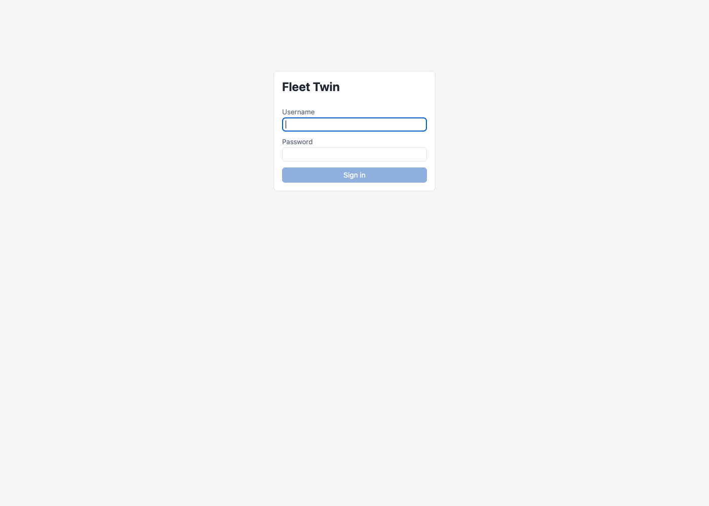

The dot at the bottom of the menu says **Live** while updates are streaming in. If it says
**Reconnecting…** the page still works, but figures are only as fresh as the last reload.

## Roles at a glance

| Page | Admin | Fleet manager | Technician | Viewer |
|---|---|---|---|---|
| Fleet Overview | ✔ | ✔ | ✔ | ✔ |
| Vehicle detail | ✔ | ✔ | ✔ | view only |
| Alerts | ✔ | ✔ | ✔ | view only |
| Maintenance Planner | ✔ | ✔ | ✔ | view only |
| Drivers & Fuel | ✔ | ✔ | – | ✔ |
| Route Planner | ✔ | ✔ | – | – |
| Reports | ✔ | ✔ | – | past reports only |
| User Management | ✔ | – | – | – |

"View only" means the page is there but its buttons and forms are not. A page you cannot use does
not appear in your menu.

- **Admin**: everything, plus creating users and reading the audit log.
- **Fleet manager**: runs the fleet day to day: watches health, plans maintenance and routes,
  produces reports.
- **Technician**: works on vehicles: sees their condition, acknowledges alerts, completes
  recommendations, records maintenance.
- **Viewer**: for people who need to see the state of the fleet without being able to change it.

## Fleet Overview

*Everyone.* The starting page: where every vehicle is and whether anything needs attention.

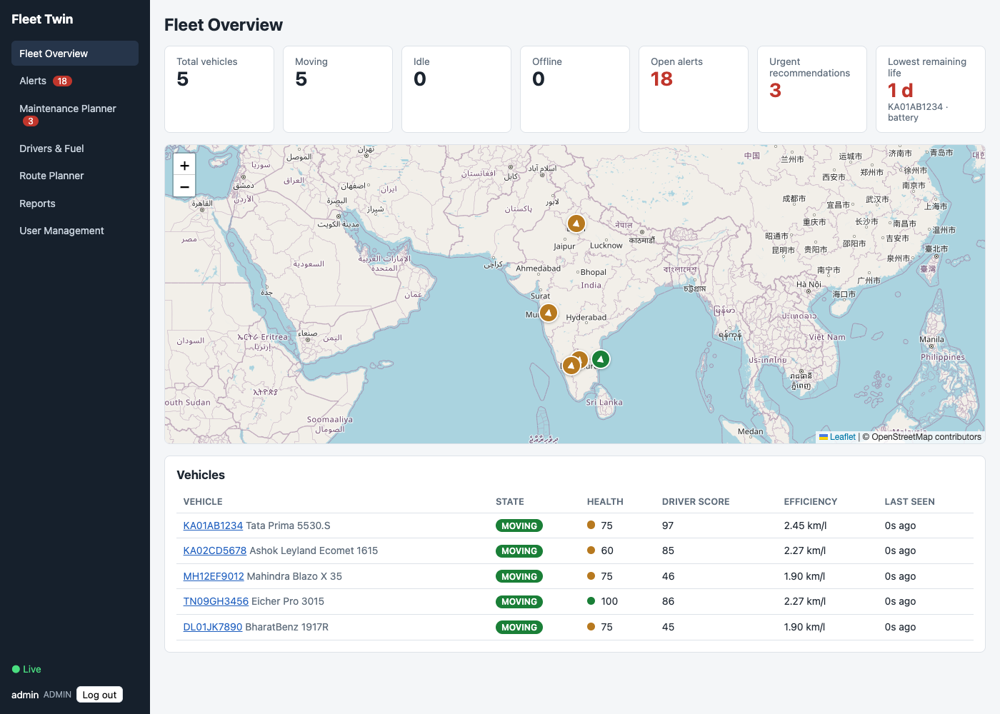

- **Cards**: vehicles moving, idle and offline; open alerts; urgent recommendations; and the part
  closest to predicted failure anywhere in the fleet. The last three are links.
- **Map**: one arrow per vehicle, pointing the way it is heading. Green, amber or red is its health
  score; a faded arrow is a vehicle that has stopped reporting.
- **Vehicle list**: state, health score, driver score and fuel efficiency over the last 7 days.
  Click a row, or a marker, to open that vehicle.

## Vehicle detail

*Everyone; viewers cannot use the buttons or the maintenance form.*

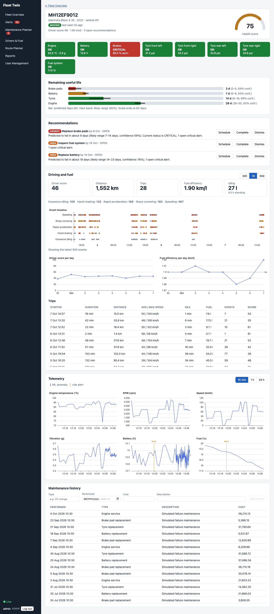

From top to bottom:

- **Header**: state, when it last reported, driver score, fuel efficiency, open recommendations,
  and the health score gauge. A purple line appears when the anomaly model flags the vehicle,
  naming the readings that looked wrong.
- **Component tiles**: engine, battery, brakes, each tyre and the fuel system, coloured by status.
- **Remaining useful life**: for brake pads, battery, tyres and engine, the predicted days left.
  The bar is the prediction and the dark band the likely range.
- **Recommendations** for this vehicle, each with its reason. *Technicians, managers and admins*
  can **Schedule** it, **Complete** it (this records the maintenance and resets that part's wear)
  or **Dismiss** it.
- **Driving and fuel**: driver score, distance, trips, efficiency and idling for the last 24 hours,
  7 days or 30 days; a timeline of driving events; daily score and efficiency charts; the trips.
- **Telemetry** charts for the last 15 minutes, hour or day. A solid purple line marks an anomaly
  alert, a dashed orange one a threshold alert.
- **Maintenance history**, with a form to add a record (*not for viewers*).

## Alerts

*Everyone; viewers cannot acknowledge.*

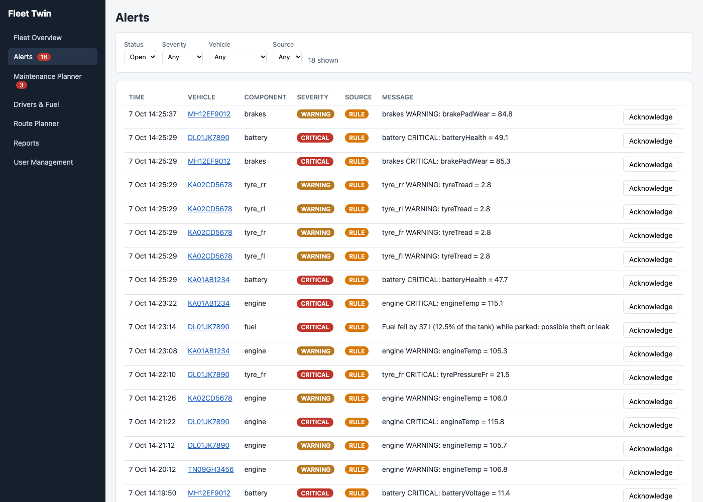

Every alert, newest first, arriving live. **RULE** alerts come from thresholds (for example engine
temperature above 115 °C), **ML** alerts from the anomaly model. Filter by status, severity, source
or vehicle.

**Acknowledge** an alert once someone has looked at it. An alert stays open until then, even if
the reading has gone back to normal, and the same problem does not raise a second alert while the
first is open. Open critical alerts keep a vehicle out of route planning, so acknowledging is not
just housekeeping. Who acknowledged what is kept in the audit log.

## Maintenance Planner

*Everyone; viewers see the list without the buttons.*

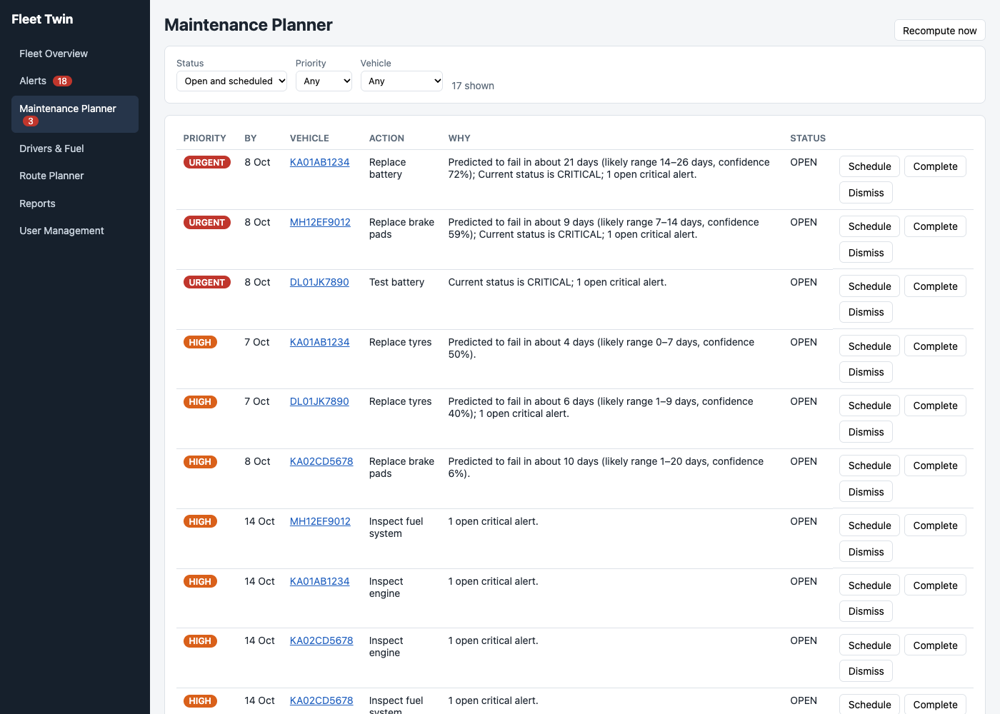

All recommendations across the fleet, most urgent first. Each one says what to do, by when, and
why, listing the evidence: the remaining-life prediction, the part's current status, open alerts,
recent anomalies, and time or distance since the last service.

- **Schedule**: the work is planned. The recommendation stays on the list as scheduled.
- **Complete**: the work is done. This creates a maintenance record and resets the part's wear.
- **Dismiss**: not needed. It is not raised again for a week unless it becomes more urgent.
- **Recompute now** runs the rules immediately instead of waiting for the next 15-minute run.

Priorities: **URGENT** means predicted failure within 3 days or a part already critical; **HIGH**
within 10 days or a critical alert open; **MEDIUM** within 3 weeks, a warning, or repeated
anomalies; **LOW** a service interval has passed.

## Drivers & Fuel

*Admin, fleet manager, viewer.*

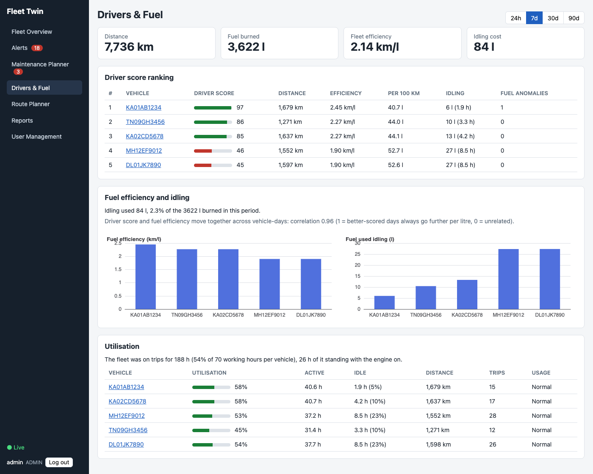

Choose 24 hours, 7, 30 or 90 days at the top right.

- **Driver score ranking**: 100 is a clean record; points come off for harsh braking, rapid
  acceleration, speeding, sharp cornering and long idling, per 100 km driven.
- **Fuel efficiency and idling**: km per litre by vehicle, how much fuel was burned standing still,
  and how closely driver score and efficiency move together.
- **Utilisation**: hours each vehicle spent on trips as a share of its working hours, with idle
  time and distance. Vehicles used much less or much more than the rest are flagged
  **Under-used** or **Over-used**.

## Route Planner

*Admin and fleet manager.*

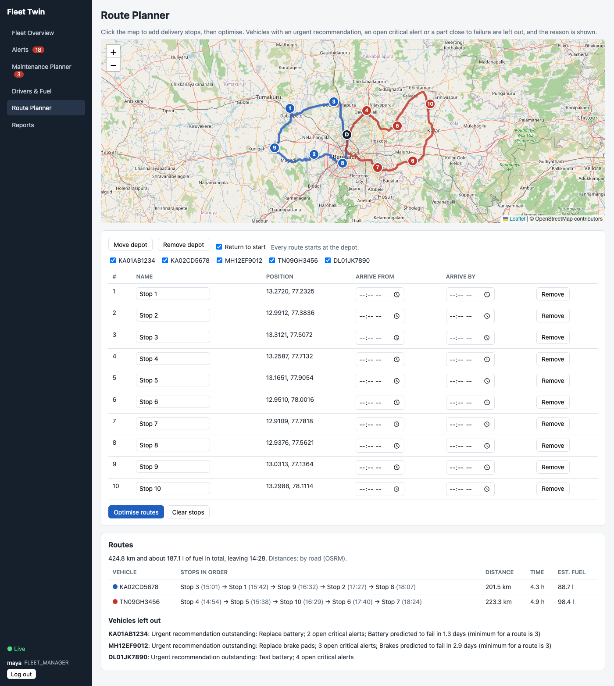

1. **Click the map** once for each delivery stop. Rename a stop in the table if you like, and give
   it an **Arrive from** / **Arrive by** time if it has a delivery window today.
2. Optionally **Set a depot** and click where it is: every route then starts there. Without a
   depot each vehicle starts from where it is now. Untick **Return to start** for one-way routes.
3. Untick any vehicle you do not want to offer.
4. **Optimise routes.**

The result is one coloured route per vehicle on the map and a table with the stops in order, the
expected arrival at each, and each route's distance, time and estimated fuel.

- **Vehicles left out** lists every vehicle that was not considered and why: an urgent
  recommendation, an open critical alert, or a part predicted to fail within 3 days. Among the
  vehicles that are fit, those with better fuel efficiency and driver scores are preferred.
- If a stop cannot be reached inside its time window it is listed as not reachable and the rest
  are still planned.
- Distances are by road when the stop is inside the map region the system was set up with, and a
  straight-line estimate otherwise. The line under the heading says which.

## Reports

*Admin and fleet manager generate; viewers can download past reports.*

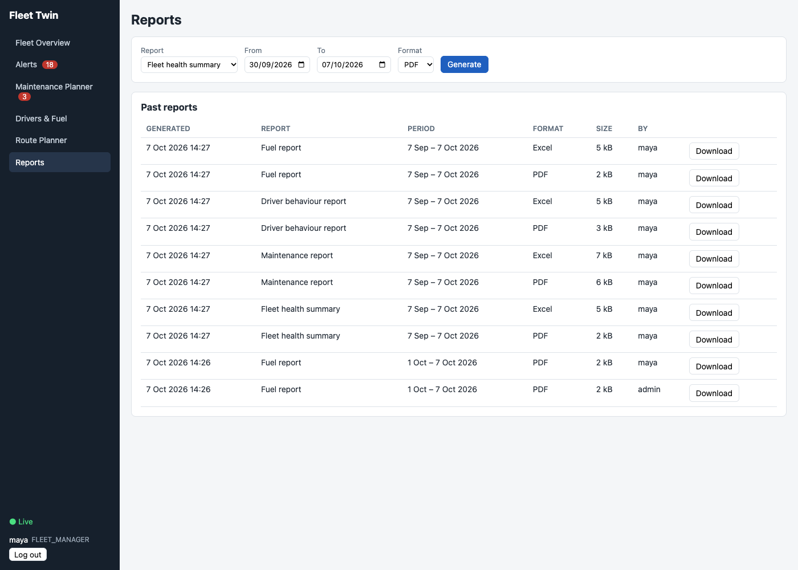

Pick a report, a date range and a format, then **Generate**. The file downloads and is added to
**Past reports**, where anyone with access to the page can download it again.

| Report | What is in it |
|---|---|
| Fleet health summary | Health score, state and lowest remaining life per vehicle; alerts and anomalies raised in the period, by vehicle and by component |
| Maintenance report | Work completed in the period with costs, costs per vehicle, and recommendations that are upcoming or overdue today |
| Driver behaviour report | Vehicles ranked by driver score, with distance, trips and events; event counts by type |
| Fuel report | Distance, fuel, efficiency and idling per vehicle; every fuel anomaly in the period |

PDF is for reading and sharing; Excel has one sheet per section with real numbers for further
analysis.

## User Management

*Admin only.*

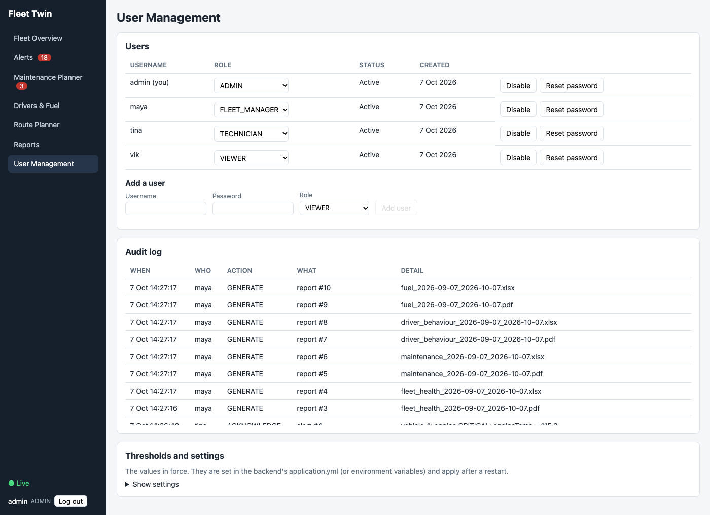

- **Users**: change a role with the drop-down, **Disable** someone who has left (their history
  stays), or **Reset password**. Any of these signs that user out. The last active admin cannot
  be disabled or demoted.
- **Add a user**: username, a password of at least 10 characters, and a role.
- **Audit log**: who acknowledged, completed, dismissed, created or changed what, and when.
- **Thresholds and settings**: the values the system is running with. They are changed in the
  server's configuration, not here.

## What other roles see

A technician's menu has only the pages for working on vehicles:

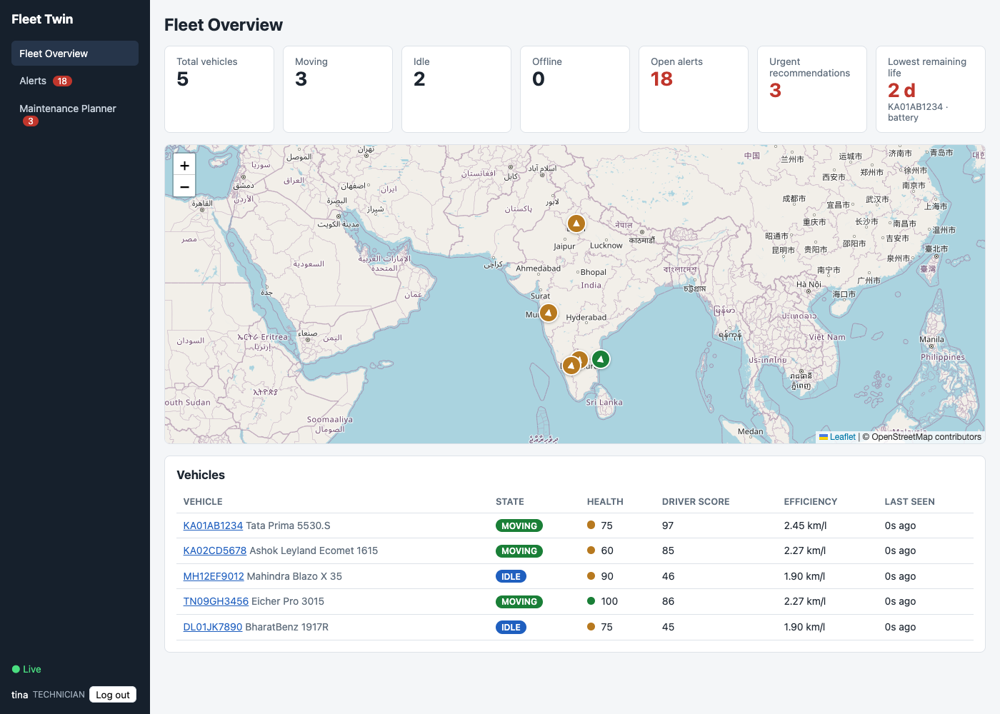

A viewer sees the same lists as a fleet manager, without any buttons:

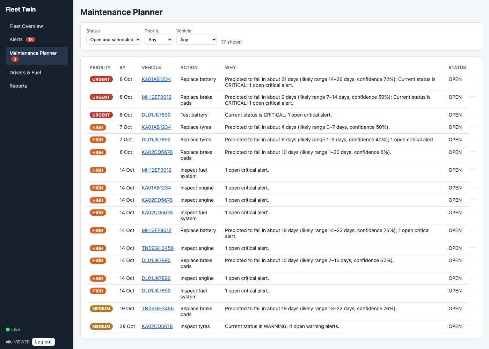
